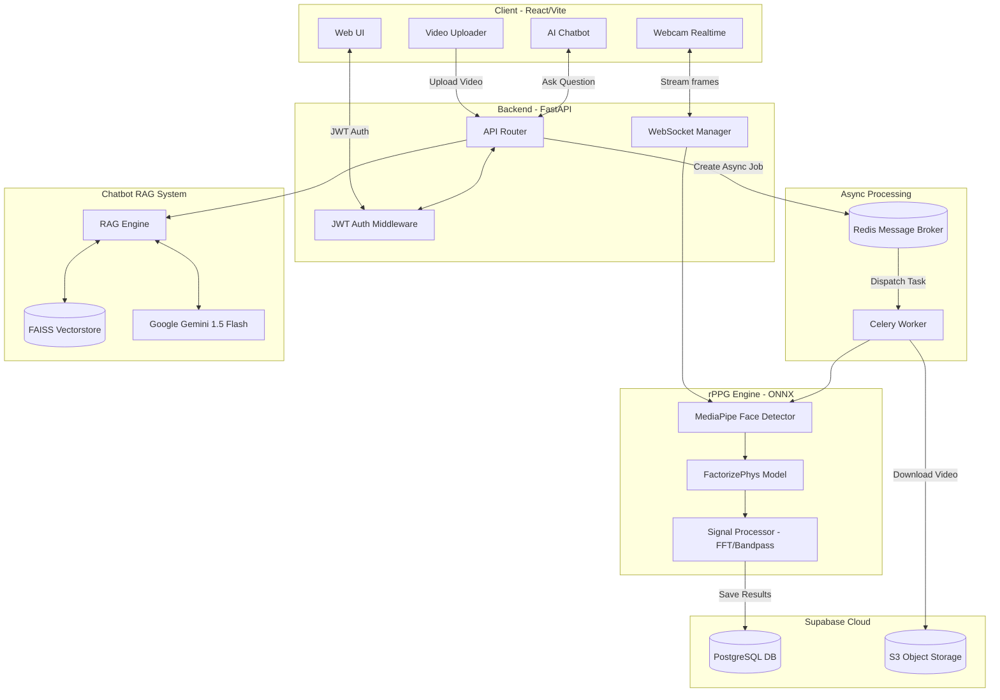

# Non-Invasive Health Analysis System

A non-invasive biometric measurement system from facial videos — extracting heart rate, blink rate, BVP signals, and integrating an AI chatbot for health consultation.


## 🌟 Key Features

- **Real-time Webcam Measurement**: Analyze heart rate, blink rate, and signal quality (SNR) in real-time.
- **Offline Video Processing**: Support uploading video files for deep background analysis.
- **AI Medical Chatbot**: Integrate Advanced RAG and Google Gemini to explain measured indicators and provide health advice based on standard documents.
- **History Management**: Store and track all analysis results over time.

## 🏗 System Architecture



The system is designed with 4 main layers:
- **Computer Vision & rPPG**: Use MediaPipe for Face Mesh, combined with ONNX Runtime to run the advanced rPPG deep learning model (FactorizePhys).
- **Signal Processing**: Extract biometric features via Fast Fourier Transform (FFT) and Butterworth Bandpass Filter.
- **AI / NLP**: Use the Gemini 1.5 Flash generative model, Hybrid Search system (FAISS + BM25) for RAG.
- **Web Fullstack**: FastAPI Backend (supporting WebSocket & Async processing) and a smooth, user-friendly React/Vite Frontend.
- **Database & Job Queue**: Centralized storage and authentication using **Supabase (PostgreSQL & Auth)**. Distribute heavy video processing resources with the **Celery + Redis** distributed queue system. Use **S3-compatible Object Storage (Supabase)** to securely manage video files.

## 🚀 Installation & Setup

### Requirements
- Python 3.10+
- Node.js 18+
- Webcam (720p or higher) for live measurement feature.
- Optional CUDA (11.8+) to accelerate rPPG.

### Starting the System

1. **Configure Environment Variables**
   - Copy the `.env.example` file to `.env` inside the `backend/` folder.
   - Update the PostgreSQL connection string (Supabase) in `SUPABASE_DB_URL` and fill in the `GEMINI_API_KEY`.

2. **Install Dependencies & Initialize Vector Data for Chatbot (First run)**
   ```bash
   cd backend
   pip install -r requirements.txt
   python scripts/build_embeddings.py
   ```

3. **Start Backend and Worker with Docker Compose**
   The system uses Redis and Celery for background processing. The fastest way is to run via Docker:
   ```bash
   docker-compose build
   docker-compose up -d
   ```
   *(The Backend API will run on port 8001)*

4. **Run Frontend Interface (In a new terminal)**
   ```bash
   cd frontend
   npm install
   npm run dev
   ```

Once completed, open your web browser at: `http://localhost:3002`

## 📖 Quick Start Guide

- **Login / Register**: Create an account or log in so the system can store and track your personal health measurement history.
- **Live Tab**: Grant camera permission. Keep your head still, look straight at the screen in a well-lit environment. Health results will continuously update after a few seconds.
- **Upload Tab**: Upload a face video (MP4/AVI format) for the system to process automatically.
- **AI Virtual Assistant**: Open the chat window in the bottom right corner of the screen to start chatting and receive health advice from the AI. (Note: Does not replace professional medical diagnosis).

> **Detailed Documentation**: For more supported rPPG models and in-depth architecture, please see the `documents` branch.

## 📊 Benchmark Results

Evaluating the rPPG heart rate measurement system on 10 users under 3 practical conditions (Evaluation metric: MAE - Mean Absolute Error, smaller is better):

### 1. Normal (Sitting still)
- **Optimal Model:** `FactorizePhys` — MAE: **~0.04 bpm**


### 2. Head Motion
- **Optimal Model:** `FactorizePhys` — MAE: **~0.83 bpm**


### 3. Talking
- **Optimal Model:** `EfficientPhys` — MAE: **~1.67 bpm**


> *Conclusion: The system achieves high accuracy (error < 2 bpm) even in noisy environments.*
