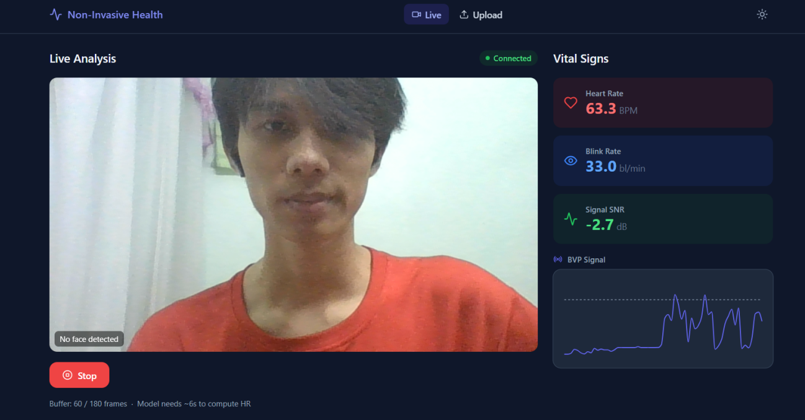
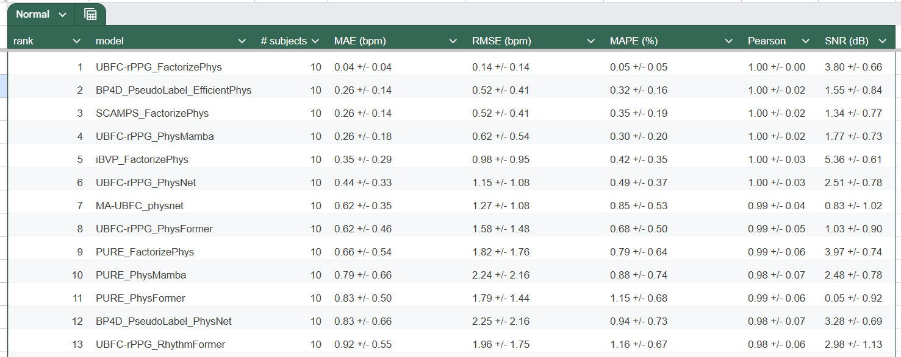
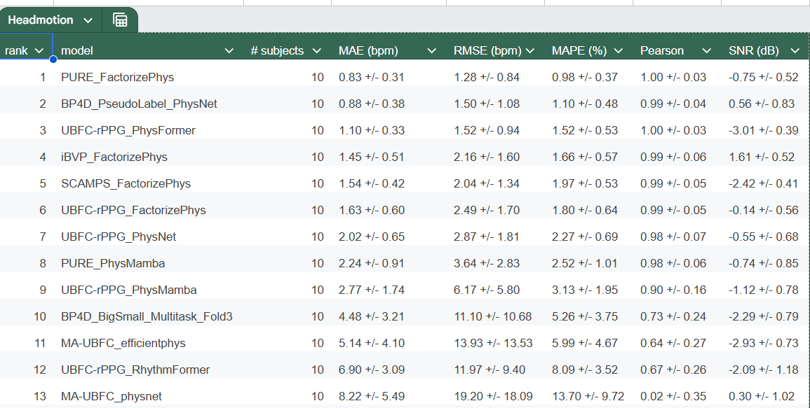
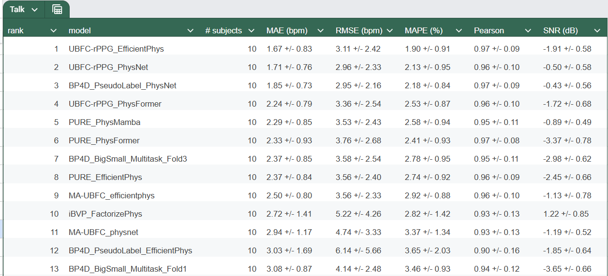

# Non-Invasive Health Analysis

Hệ thống đo sinh trắc học không xâm lấn từ video khuôn mặt — nhịp tim, tốc độ chớp mắt, tín hiệu BVP.

```
webcam / video  →  face detection (MediaPipe)
               →  rPPG inference (ONNX hoặc PyTorch fallback)
               →  signal processing (FFT)
               →  Heart Rate, Blink Rate, SNR
```



---

## Yêu cầu hệ thống

| Thành phần | Phiên bản |
|-----------|-----------|
| Python | 3.10+ |
| Node.js | 18+ |
| CUDA | 11.8+ (tùy chọn) |
| RAM | 8 GB+ |
| Webcam | Bất kỳ (720p khuyến nghị) |

---

## Cấu trúc dự án

```
Non-Invasive/
├── rPPG/                    # Model research & export
│   ├── models/              # 10 kiến trúc: DeepPhys, TSCAN, PhysNet, EfficientPhys,
│   │                        #   PhysFormer, PhysMamba, RhythmFormer, BigSmall, iBVPNet, FactorizePhys
│   ├── export/              # Script convert .pth → .onnx
│   │   └── export_onnx.py
│   ├── export_batch.sh      # Batch export toàn bộ weights
│   ├── evaluation/          # Metrics: MAE, RMSE, SNR, Pearson
│   ├── weights/             # 36 pretrained .pth + 34 .onnx đã convert
│   └── notebooks_inference/ # Jupyter inference notebooks
├── backend/                 # FastAPI server (port 8001)
│   ├── app/
│   │   ├── core/            # config, lifespan
│   │   ├── services/        # rppg_engine, face_detector, preprocessor,
│   │   │                    #   signal_processor, blink_detector
│   │   └── api/             # routes + websocket
│   ├── weights/             # 34 .onnx models + model_config.json
│   ├── doc/
│   │   └── convert.md       # Ghi chú quá trình convert ONNX
│   └── .env
├── frontend/                # React + TypeScript web app (port 3002)
│   ├── src/
│   │   ├── pages/           # Home (live webcam), Upload (offline video)
│   │   ├── components/      # VitalSignCard, BVPChart, FaceOverlay
│   │   └── hooks/           # useWebSocket, useWebcam
│   └── package.json
├── figures/                 # Ảnh demo và benchmark
└── README.md
```

---

## Chạy hệ thống

### Bước 1 — Chạy Backend

```bash
cd backend
python -m uvicorn app.main:app --reload --port 8001
```

Startup thành công:
```
INFO  Loading ONNX model from: weights/PURE_DeepPhys.onnx
INFO  ONNX backend | PURE_DeepPhys.onnx | img_size=72 | buffer=180
INFO  Startup complete.
```

Kiểm tra:
- `http://localhost:8001/health` → `{"status":"ok","model_loaded":true}`
- `http://localhost:8001/docs` → Swagger UI

### Bước 2 — Chạy Frontend

```bash
cd frontend
npm install     # chỉ lần đầu
npm run dev
```

Mở trình duyệt: `http://localhost:3002`

### Chạy song song

**Terminal 1:**
```bash
cd backend && python -m uvicorn app.main:app --reload --port 8001
```

**Terminal 2:**
```bash
cd frontend && npm run dev
```

---

## Hướng dẫn sử dụng

### Live Analysis (webcam)

1. Mở `http://localhost:3002`
2. Click **Start Camera** — trình duyệt hỏi quyền camera
3. Nhìn thẳng vào webcam, đủ ánh sáng
4. Sau ~12 giây (180 frames @ 15fps), kết quả xuất hiện:
   - **Heart Rate** — nhịp tim (BPM)
   - **Blink Rate** — tốc độ chớp mắt (lần/phút)
   - **Signal SNR** — chất lượng tín hiệu (dB), > 5 dB là tốt
   - **BVP chart** — dạng sóng mạch máu real-time
5. Click **Stop** để dừng

> Ngồi thẳng, không cử động đầu. Ánh sáng từ phía trước, không ngược sáng.

### Upload video offline

1. Chuyển sang tab **Upload**
2. Kéo thả file video (MP4, AVI, MOV) hoặc click chọn file
3. Chờ xử lý → kết quả hiện ngay

---

## Kết quả Benchmark

Đánh giá trên 10 subjects với 3 điều kiện thực tế.  
Metrics: MAE (bpm), RMSE (bpm), MAPE (%), Pearson, SNR (dB).

### Điều kiện bình thường

> **Top 1:** UBFC-rPPG_FactorizePhys — MAE **0.04 bpm**, Pearson **1.00**

### Điều kiện chuyển động đầu

> **Top 1:** PURE_FactorizePhys — MAE **0.83 bpm**, Pearson **1.00**

### Điều kiện nói chuyện

> **Top 1:** UBFC-rPPG_EfficientPhys — MAE **1.67 bpm**, Pearson **0.97**

| Điều kiện | Model tốt nhất | MAE tốt nhất |
|-----------|---------------|-------------|
| Bình thường | FactorizePhys | ~0.04 bpm |
| Chuyển động đầu | FactorizePhys | ~0.83 bpm |
| Nói chuyện | EfficientPhys | ~1.67 bpm |

---

## API Reference

### `GET /health`
```json
{ "status": "ok", "model_loaded": true, "device": "cpu" }
```

### `POST /video/upload`

**Request:** `multipart/form-data`, field `file`

**Response:**
```json
{
  "filename": "test.mp4",
  "total_frames": 900,
  "duration_sec": 30.0,
  "heart_rate": 72.5,
  "blink_rate": 14.1,
  "snr_db": 8.3,
  "bvp_signal": [0.012, -0.005, "..."]
}
```

### `WS /ws/stream`

```json
// Client → Server
{ "type": "frame", "data": "<base64 JPEG>" }
{ "type": "reset" }

// Server → Client
{ "type": "face", "detected": true, "bbox": [x, y, w, h] }
{ "type": "vitals", "heart_rate": 72.5, "blink_rate": 14.1,
  "snr_db": 8.3, "bvp_window": [...] }
```

---

## Thay đổi model

### Dùng model đã có trong `backend/weights/`

Backend có sẵn **34 model ONNX** — xem danh sách đầy đủ trong [backend/doc/convert.md](backend/doc/convert.md).

Ví dụ dùng FactorizePhys:
```env
# backend/.env
MODEL_PATH=weights/UBFC-rPPG_FactorizePhys_FSAM_Res.onnx
```

Cập nhật `backend/weights/model_config.json` cho đúng model:
```json
{ "model": "FactorizePhys", "img_size": 72, "chunk": 181, "norm_type": "DiffNorm", "fps": 30 }
```

### Dùng PyTorch fallback (.pth trực tiếp)

Backend tự động fallback sang PyTorch khi:
- `MODEL_PATH` trỏ tới file `.pth`, hoặc
- File `.onnx` không tồn tại nhưng có file `.pth` tương ứng (cùng thư mục hoặc `rPPG/weights/`)

```env
# backend/.env — dùng PhysMamba trực tiếp từ .pth
MODEL_PATH=../rPPG/weights/PURE_PhysMamba_DiffNormalized.pth
```

> **Lưu ý:** PyTorch fallback dành cho DeepPhys-style models (input 2 frame). 
> PhysMamba yêu cầu `selective_scan_cuda` CUDA kernel — chưa tương thích với CUDA 13.0.

### Export model mới sang ONNX

```bash
cd rPPG
python export/export_onnx.py \
  --model   DeepPhys \
  --weights weights/PURE_DeepPhys.pth \
  --output  weights/PURE_DeepPhys.onnx \
  --validate

cp weights/PURE_DeepPhys.onnx ../backend/weights/
```

Batch export toàn bộ:
```bash
cd rPPG
bash export_batch.sh
```

---

## Danh sách model có sẵn

| Dataset | DeepPhys | EfficientPhys | TSCAN | PhysNet | PhysFormer | RhythmFormer | FactorizePhys | iBVPNet | BigSmall | PhysMamba |
|---------|:---:|:---:|:---:|:---:|:---:|:---:|:---:|:---:|:---:|:---:|
| PURE    | ✅ | ✅ | ✅ | ✅ | ✅ | ✅ | ✅ | ✅ | — | ⚠️ |
| SCAMPS  | ✅ | ✅ | ✅ | ✅ | ✅ | — | ✅ | — | — | — |
| UBFC-rPPG | ✅ | ✅ | ✅ | ✅ | ✅ | ✅ | ✅ | — | — | ⚠️ |
| BP4D PseudoLabel | ✅ | ✅ | ✅ | ✅ | — | — | — | — | ✅✅✅ | — |
| iBVP    | — | ✅ | — | — | — | — | ✅ | — | — | — |
| MA-UBFC | ✅ | ✅ | ✅ | ✅ | — | — | — | — | — | — |

✅ = ONNX sẵn trong `backend/weights/`  
⚠️ = Chỉ có `.pth` (PyTorch fallback, xem [backend/doc/convert.md](backend/doc/convert.md))

---

## Lưu ý

### Kết quả HR không ổn định (SNR thấp)
→ Ánh sáng đủ sáng, ngồi yên trong 12 giây đầu.  
→ SNR < 3 dB: thử FactorizePhys hoặc PhysFormer.

### Face không được phát hiện
→ Khoảng cách: 40–80 cm, nhìn thẳng, ánh sáng từ phía trước.
