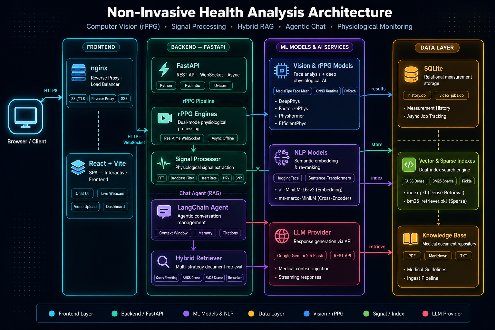

# Non-Invasive Health Analysis System

Hệ thống đo sinh trắc học không xâm lấn từ video khuôn mặt — trích xuất nhịp tim (Heart Rate), biến thiên nhịp tim (HRV), tín hiệu BVP (Blood Volume Pulse), và tích hợp chatbot AI tư vấn sức khỏe.


---

## Mục lục

1. [Tổng quan dự án](#1-tổng-quan-dự-án)
2. [Cơ sở lý thuyết](#2-cơ-sở-lý-thuyết)
   - 2.1 [Remote Photoplethysmography (rPPG)](#21-remote-photoplethysmography-rppg)
   - 2.2 [Mô hình FactorizePhys và FSAM](#22-mô-hình-factorizephys-và-fsam)
   - 2.3 [Xử lý tín hiệu số (DSP)](#23-xử-lý-tín-hiệu-số-dsp)
   - 2.4 [Retrieval-Augmented Generation (RAG)](#24-retrieval-augmented-generation-rag)
3. [Kiến trúc hệ thống](#3-kiến-trúc-hệ-thống)
4. [Chi tiết kỹ thuật triển khai](#4-chi-tiết-kỹ-thuật-triển-khai)
   - 4.1 [Pipeline Computer Vision & rPPG](#41-pipeline-computer-vision--rppg)
   - 4.2 [Pipeline xử lý tín hiệu](#42-pipeline-xử-lý-tín-hiệu)
   - 4.3 [Chatbot AI (Advanced RAG)](#43-chatbot-ai-advanced-rag)
   - 4.4 [Backend API & WebSocket](#44-backend-api--websocket)
   - 4.5 [Xử lý video bất đồng bộ (Celery + Redis)](#45-xử-lý-video-bất-đồng-bộ-celery--redis)
   - 4.6 [Frontend](#46-frontend)
   - 4.7 [Xác thực & Lưu trữ](#47-xác-thực--lưu-trữ)
5. [Kết quả đánh giá (Benchmark)](#5-kết-quả-đánh-giá-benchmark)
6. [Cài đặt & Khởi chạy](#6-cài-đặt--khởi-chạy)
7. [Hướng dẫn sử dụng](#7-hướng-dẫn-sử-dụng)

---

## 1. Tổng quan dự án

Hệ thống Non-Invasive Health Analysis cho phép đo các chỉ số sinh lý (nhịp tim, HRV, chất lượng tín hiệu SNR) từ video khuôn mặt mà **không cần bất kỳ cảm biến tiếp xúc nào**. Hệ thống hỗ trợ hai chế độ hoạt động:

- **Đo thời gian thực (Real-time)**: Phân tích trực tiếp từ webcam qua giao thức WebSocket, cho kết quả liên tục sau vài giây.
- **Phân tích video tải lên (Offline)**: Người dùng upload file video (MP4/AVI), hệ thống xử lý ngầm bằng hàng đợi phân tán Celery + Redis và trả kết quả khi hoàn thành.

Ngoài ra, hệ thống tích hợp **Chatbot AI** sử dụng kiến trúc Advanced RAG (Retrieval-Augmented Generation) kết hợp Google Gemini, giúp người dùng hiểu các chỉ số đo được và nhận tư vấn sức khỏe dựa trên tài liệu y khoa chuẩn.

### Các tính năng chính

| Tính năng | Mô tả |
|---|---|
| **Đo real-time qua Webcam** | Phân tích nhịp tim, HRV, SNR liên tục từ luồng webcam |
| **Upload & phân tích video** | Hỗ trợ MP4/AVI, xử lý nền bằng Celery Worker |
| **Chatbot AI tư vấn sức khỏe** | Advanced RAG + Google Gemini, giải thích chỉ số và tư vấn |
| **Quản lý lịch sử** | Lưu trữ và theo dõi toàn bộ kết quả phân tích theo thời gian |
| **Xác thực người dùng** | Đăng nhập/Đăng ký qua Supabase Auth |
| **Điều chỉnh theo độ tuổi** | Tự động thay đổi dải bandpass phù hợp nhóm tuổi (trẻ sơ sinh → người lớn) |

---

## 2. Cơ sở lý thuyết

### 2.1 Remote Photoplethysmography (rPPG)

**Photoplethysmography (PPG)** là kỹ thuật đo sự thay đổi thể tích máu trong mô bằng cách phát hiện sự biến đổi cường độ ánh sáng. PPG truyền thống sử dụng cảm biến tiếp xúc (ngón tay, tai).

**Remote PPG (rPPG)** mở rộng nguyên lý này bằng cách sử dụng **camera thông thường** để thu nhận những biến đổi màu sắc cực nhỏ trên da mặt — biến đổi mà mắt thường không thể nhìn thấy nhưng tương quan chặt chẽ với chu kỳ co bóp của tim.

**Nguyên lý hoạt động:**

1. **Thu nhận video**: Camera ghi lại chuỗi khung hình khuôn mặt tại 30 FPS.
2. **Trích xuất ROI (Region of Interest)**: Dùng MediaPipe Face Mesh (468 điểm đặc trưng) để xác định vùng da mặt, loại bỏ mắt, miệng, tóc.
3. **Phát hiện biến đổi vi mô**: Mô hình deep learning (FactorizePhys) phân tích chuỗi frame để tách thành phần tín hiệu BVP ẩn dưới nhiễu chuyển động và chiếu sáng.
4. **Xử lý tín hiệu**: Áp dụng các bộ lọc số (Detrend, Bandpass) và phân tích phổ (FFT) để trích xuất tần số nhịp tim chính xác.

### 2.2 Mô hình FactorizePhys và FSAM

Hệ thống sử dụng mô hình **FactorizePhys** (NeurIPS 2024) — một kiến trúc rPPG siêu nhẹ (~220K tham số) nhưng đạt độ chính xác ngang với các mô hình lớn hơn 100 lần.

**Kiến trúc tổng quan:**

1. **Input**: Chuỗi khung hình video đã cắt vùng mặt, kích thước `(N, 3, T+1, 72, 72)` (batch, RGB, thời gian, chiều cao, chiều rộng).
2. **3D CNN Backbone** (`rPPG_FeatureExtractor`): Gồm nhiều khối ConvBlock3D để trích xuất đặc trưng không-thời gian (spatio-temporal features) từ chuỗi frame.
3. **FSAM — Factorized Self-Attention Module**: Module attention cốt lõi, thay thế self-attention truyền thống O(N²) bằng **Non-negative Matrix Factorization (NMF)** với độ phức tạp O(N·R), trong đó R=1.
4. **BVP Head**: Chiếu đặc trưng đã qua attention thành tín hiệu rPPG 1 chiều, kích thước `(N, T)`.

**FSAM — Cơ chế NMF Attention:**

Module FSAM là điểm đột phá của FactorizePhys. Thay vì tính ma trận attention N×N (tốn kém), FSAM phân rã ma trận đặc trưng thành tích của hai ma trận hạng thấp:

1. **Dàn phẳng đặc trưng**: Tensor 5D `(N, C, T, H, W)` được reshape thành ma trận 2D `(B, D, HW·T)`.
2. **Phân rã NMF**: Ma trận đặc trưng F được xấp xỉ bởi tích `F ≈ B · C`, trong đó:
   - **B** (Bases): Ma trận cơ sở `(B, D, R)` — biểu diễn nén của không gian đặc trưng.
   - **C** (Coefficients): Ma trận hệ số `(B, R, HW·T)` — trọng số kết hợp.
3. **Cập nhật lặp (Multiplicative Update)**: Lặp 3 bước cập nhật B và C theo quy tắc nhân:
   ```
   C ← C * (Bᵀ F) / (Bᵀ B C + ε)
   B ← B * (F Cᵀ) / (B C Cᵀ + ε)
   ```
   Quy tắc này đảm bảo B và C luôn không âm (non-negative), tạo ra biểu diễn thưa (sparse) và dễ giải thích.
4. **Cộng Residual**: Sau khi tối ưu, cộng sai số tái tạo `(F̂ - F)` vào đặc trưng gốc: `x = x + λ · (F̂ - F)`.

**Tại sao R=1 là đủ?** Tín hiệu nhịp tim về bản chất là một dao động đơn (single sinusoid) — chỉ có 1 tần số trội (dominant frequency). Do đó, 1 thành phần (rank-1) đã đủ để biểu diễn cấu trúc attention cần thiết.

**So sánh hiệu quả tham số:**

| Mô hình | Số tham số | Độ chính xác HR |
|---|---|---|
| PhysFormer | ~30 M | Xuất sắc |
| RhythmFormer | ~13 M | Xuất sắc |
| EfficientPhys | ~9 M | Tốt |
| PhysNet | ~3 M | Tốt |
| **FactorizePhys** | **~220 K** | **Xuất sắc** |

→ FactorizePhys đạt **tỷ lệ accuracy/params tốt nhất**, lý tưởng cho triển khai trên thiết bị biên (edge deployment).

### 2.3 Xử lý tín hiệu số (DSP)

Sau khi mô hình rPPG trả về tín hiệu BVP thô, pipeline xử lý tín hiệu gồm các bước:

#### a) Tích lũy (Cumulative Sum)

Tín hiệu BVP thô từ mô hình là dạng vi phân (differential). Bước đầu tiên là tích lũy tổng để khôi phục dạng sóng gốc:

```
sig = cumsum(bvp_raw)
```

#### b) Khử xu hướng (Detrending) — Phương pháp Tarvainen

Sử dụng phương pháp **Smoothness Priors** (Tarvainen et al.) để loại bỏ thành phần trôi chậm (baseline wander) mà không làm méo tín hiệu nhịp tim:

```
sig_detrended = (I - inv(I + λ² · Dᵀ · D)) · sig
```

Trong đó `D` là ma trận sai phân bậc 2, `λ=100` kiểm soát mức độ làm mượt.

#### c) Lọc thông dải (Bandpass Filter) — Butterworth bậc 2

Áp dụng bộ lọc Butterworth bậc 2 (IIR) để chỉ giữ lại thành phần tần số trong dải nhịp tim hợp lệ. Dải lọc được **tự động điều chỉnh theo nhóm tuổi**:

| Nhóm tuổi | Dải nhịp tim (BPM) | Dải tần số (Hz) |
|---|---|---|
| Trẻ sơ sinh | 100 – 205 | 1.67 – 3.42 |
| 2–12 tháng | 100 – 180 | 1.67 – 3.00 |
| 1–2 tuổi | 98 – 140 | 1.63 – 2.33 |
| 3–5 tuổi | 80 – 120 | 1.33 – 2.00 |
| 6–7 tuổi | 75 – 118 | 1.25 – 1.97 |
| ≥ 8 tuổi | 60 – 100 | 1.00 – 1.67 |

#### d) Phân tích phổ (FFT) — Trích xuất nhịp tim và SNR

Sử dụng **Periodogram** (biến thể của FFT) để phân tích phổ tần số của tín hiệu đã lọc:

- **Heart Rate (HR)**: Tần số tại đỉnh công suất cao nhất trong dải bandpass, nhân 60 để chuyển sang BPM.
- **Signal-to-Noise Ratio (SNR)**: Tỷ số công suất tín hiệu (quanh tần số HR ± 6 BPM và họa tần bậc 2) so với công suất nhiễu (phần còn lại trong dải bandpass), tính theo dB:

```
SNR = 10 · log₁₀(P_signal / P_noise)
```

#### e) Heart Rate Variability (HRV)

HRV được tính từ khoảng cách giữa các đỉnh liên tiếp (Inter-Beat Interval) của tín hiệu BVP:

| Chỉ số | Ý nghĩa |
|---|---|
| **SDNN** (ms) | Độ lệch chuẩn của khoảng IBI — phản ánh tổng biến thiên nhịp tim |
| **RMSSD** (ms) | Căn bậc hai trung bình bình phương sai phân IBI — đánh giá hoạt động phó giao cảm |
| **pNN50** (%) | Tỷ lệ IBI liên tiếp chênh > 50ms — chỉ báo trương lực phó giao cảm |

### 2.4 Retrieval-Augmented Generation (RAG)

Chatbot AI sử dụng kiến trúc **Advanced RAG** để trả lời câu hỏi dựa trên tài liệu y khoa nội bộ, kết hợp với khả năng sinh ngôn ngữ tự nhiên của LLM.

**Pipeline RAG gồm 4 giai đoạn:**

1. **Indexing** (Offline): Tài liệu nội bộ (Markdown, TXT, PDF) được chia nhỏ thành các chunks (500 ký tự, overlap 50), sau đó mã hóa thành vector embedding bằng mô hình `all-MiniLM-L6-v2` (Sentence Transformers) và lưu vào FAISS index. Song song, xây dựng BM25 index cho tìm kiếm từ khóa.

2. **Retrieval** (Online): Khi nhận câu hỏi, hệ thống sử dụng **Hybrid Search** kết hợp:
   - **FAISS** (Dense Retrieval — 70% trọng số): Tìm kiếm theo ngữ nghĩa (semantic similarity).
   - **BM25** (Sparse Retrieval — 30% trọng số): Tìm kiếm theo từ khóa (lexical matching).
   - **Multi-Query Rewriting**: LLM tự sinh thêm các biến thể của câu hỏi gốc để mở rộng phạm vi tìm kiếm.
   - **Cross-Encoder Re-ranking**: Dùng mô hình `ms-marco-MiniLM-L-6-v2` để xếp hạng lại và chọn Top-5 documents chính xác nhất.

3. **Generation**: Các documents được chọn được đưa vào prompt cùng câu hỏi gốc, gửi tới **Google Gemini** (mô hình `gemini-1.5-flash`) để sinh câu trả lời.

4. **Fallback**: Nếu tài liệu nội bộ không có thông tin phù hợp, hệ thống tự động chuyển sang hỏi trực tiếp Gemini bằng kiến thức tổng quát, đồng thời ghi rõ nguồn trả lời cho người dùng.

---

## 3. Kiến trúc hệ thống



Hệ thống được thiết kế theo kiến trúc **microservice** gồm 4 tầng chính:

### Tầng 1 — Computer Vision & rPPG

| Thành phần | Công nghệ | Vai trò |
|---|---|---|
| Face Detection | MediaPipe Face Mesh | Phát hiện và theo dõi khuôn mặt 468 điểm |
| Bounding Box Stabilization | EMA Smoothing (α=0.7) | Chống rung lắc bbox, ổn định tín hiệu |
| rPPG Inference | ONNX Runtime | Chạy mô hình FactorizePhys tối ưu |
| Input Preprocessing | NumPy vectorized | BGR→RGB, normalize [0,1], reshape NCTHW |

### Tầng 2 — Signal Processing

| Thành phần | Công nghệ | Vai trò |
|---|---|---|
| Detrending | Smoothness Priors (Tarvainen) | Khử baseline wander |
| Bandpass Filter | Butterworth bậc 2 (SciPy) | Lọc dải tần nhịp tim theo tuổi |
| Spectral Analysis | Periodogram / FFT (SciPy) | Trích xuất HR và SNR |
| Peak Detection | `scipy.signal.find_peaks` | Tính HRV (SDNN, RMSSD, pNN50) |

### Tầng 3 — AI / NLP

| Thành phần | Công nghệ | Vai trò |
|---|---|---|
| LLM | Google Gemini 1.5 Flash | Sinh câu trả lời |
| Dense Retrieval | FAISS + all-MiniLM-L6-v2 | Tìm kiếm ngữ nghĩa |
| Sparse Retrieval | BM25 (rank-bm25) | Tìm kiếm từ khóa |
| Query Rewriting | MultiQueryRetriever (LangChain) | Mở rộng câu hỏi |
| Re-ranking | Cross-Encoder ms-marco-MiniLM | Xếp hạng lại kết quả |
| Orchestration | LangChain | Kết nối toàn bộ pipeline RAG |

### Tầng 4 — Web Fullstack & Infrastructure

| Thành phần | Công nghệ | Vai trò |
|---|---|---|
| Backend API | FastAPI (Python) | REST API + WebSocket |
| Frontend | React 18 + Vite 5 | Giao diện người dùng SPA |
| Task Queue | Celery + Redis | Xử lý video nền phân tán |
| Database | Supabase (PostgreSQL) | Lưu trữ lịch sử, quản lý jobs |
| Authentication | Supabase Auth | Đăng nhập/Đăng ký, JWT tokens |
| Object Storage | Supabase S3 (boto3) | Lưu trữ file video upload |
| Containerization | Docker Compose | Triển khai đa dịch vụ |

---

## 4. Chi tiết kỹ thuật triển khai

### 4.1 Pipeline Computer Vision & rPPG

#### Face Detection & Stabilization

Hệ thống sử dụng **MediaPipe Face Mesh** với các tham số tối ưu:
- `min_detection_confidence = 0.7` (tăng từ mặc định 0.5 để giảm false positive)
- `min_tracking_confidence = 0.6`
- Bounding box được mở rộng **1.4x** so với vùng mặt phát hiện để đảm bảo đủ thông tin da.

**Chống rung lắc (EMA Smoothing)**: Tọa độ bbox được làm mượt bằng Exponential Moving Average với hệ số α=0.7:

```
smoothed[i] = α · raw[i] + (1 - α) · smoothed[i-1]
```

**Cơ chế Miss Tolerance**: Khi mất mặt, hệ thống giữ bbox cũ trong 8 frame (miss tolerance) trước khi reset — tránh nhấp nháy khi mặt bị che tạm thời.

#### rPPG Engine (ONNX Runtime)

Mô hình FactorizePhys được export sang định dạng ONNX để tối ưu inference:
- **Input**: Tensor `(1, 3, T, 72, 72)` — RGB, float32, normalized [0,1].
- **Output**: Mảng BVP 1 chiều `(T,)`.
- Hỗ trợ cả **CPU** và **CUDA** (GPU acceleration).

**Chiến lược Inference Realtime**: Để tránh lag trên WebSocket:
- Chỉ infer 1 lần mỗi **15 frame** (~0.5 giây ở 30 FPS).
- Inference chạy trong **background thread** riêng biệt, không block WebSocket event loop.
- Sử dụng `deque` (maxlen) làm circular buffer cho frames.

### 4.2 Pipeline xử lý tín hiệu

Toàn bộ pipeline xử lý tín hiệu được thực hiện trong module `signal_processor.py`:

```
BVP thô → Cumulative Sum → Detrend (Tarvainen) → Bandpass (Butterworth)
    → FFT (Periodogram) → Heart Rate (BPM) + SNR (dB)
    → Peak Detection → HRV (SDNN, RMSSD, pNN50)
```

Chi tiết mỗi bước đã được trình bày ở [Mục 2.3](#23-xử-lý-tín-hiệu-số-dsp).

### 4.3 Chatbot AI (Advanced RAG)

#### Xây dựng Knowledge Base (Offline)

```bash
cd backend
python scripts/build_embeddings.py
```

Script này thực hiện:
1. Quét tất cả file `.md`, `.txt`, `.pdf` trong thư mục `backend/app/documents/`.
2. Chia nhỏ thành chunks (500 ký tự, overlap 50) bằng `RecursiveCharacterTextSplitter`.
3. Mã hóa bằng `sentence-transformers/all-MiniLM-L6-v2` và lưu FAISS index.
4. Xây dựng BM25 index song song và serialize bằng pickle.

#### Pipeline truy vấn (Online)

```
Câu hỏi → Multi-Query Rewriting → Hybrid Search (FAISS 70% + BM25 30%)
    → Cross-Encoder Re-ranking (Top 5) → Gemini Generation → Câu trả lời
```

Nếu không tìm thấy tài liệu phù hợp → Fallback sang Gemini kiến thức tổng quát (có đánh dấu nguồn).

#### Cơ chế Fallback & Quota Handling

- Nếu model chính (gemini-1.5-flash) bị rate limit → tự động chuyển sang model dự phòng (gemini-1.5-pro).
- Response luôn kèm trường `from_internal_docs` để frontend phân biệt nguồn trả lời.

### 4.4 Backend API & WebSocket

Backend xây dựng trên **FastAPI** với các nhóm endpoint:

| Endpoint | Phương thức | Chức năng |
|---|---|---|
| `/ws/stream` | WebSocket | Nhận JPEG frames, trả vitals real-time |
| `/video/upload` | POST | Upload video, xử lý đồng bộ (synchronous) |
| `/video/upload-async` | POST | Upload video, xử lý bất đồng bộ qua Celery |
| `/video/jobs/{job_id}` | GET | Kiểm tra trạng thái job |
| `/chat` | POST | Gửi câu hỏi tới chatbot RAG |
| `/auth/login` | POST | Đăng nhập |
| `/auth/register` | POST | Đăng ký |
| `/history` | GET | Lấy lịch sử đo |

#### Giao thức WebSocket

```
Client → Server: {"type": "frame", "data": "<base64 JPEG>", "age": 25}
Client → Server: {"type": "reset"}
Server → Client: {"type": "face", "detected": true, "bbox": [x, y, w, h]}
Server → Client: {"type": "vitals", "heart_rate": 72.5, "snr_db": 8.3,
                   "hrv_ms": 45.2, "sdnn_ms": 38.1, "rmssd_ms": 45.2,
                   "pnn50": 12.5, "bvp_window": [...]}
```

Mọi tác vụ nặng (face detection, rPPG inference, signal processing) đều được chạy trong **thread pool executor** (`run_in_executor`) để không block asyncio event loop.

### 4.5 Xử lý video bất đồng bộ (Celery + Redis)

Để xử lý video dài mà không block API server, hệ thống sử dụng kiến trúc **distributed task queue**:

```
Client upload → API Server → S3 Storage (lưu video)
                           → Redis (gửi task message)
                           → Celery Worker (nhận task, xử lý)
                                → Download video từ S3
                                → Chạy rPPG pipeline
                                → Lưu kết quả vào PostgreSQL
                                → Xóa video khỏi S3
```

**Cấu hình Celery:**
- `task_acks_late = True`: Chỉ xác nhận task SAU khi hoàn thành (đảm bảo không mất task khi worker crash).
- `worker_prefetch_multiplier = 1`: Mỗi worker chỉ lấy 1 task tại một thời điểm (tránh memory overflow do video lớn).
- `max_retries = 3`: Tự động retry tối đa 3 lần nếu thất bại.
- Task routing: `video.*` → queue riêng biệt để tránh block task khác.

**Worker Initialization**: Mô hình AI (RPPGEngine, FaceDetector) được khởi tạo **một lần duy nhất** khi worker khởi động thông qua signal `worker_process_init`, tiết kiệm RAM và thời gian xử lý.

### 4.6 Frontend

Frontend được xây dựng bằng **React 18 + Vite 5**, sử dụng các thư viện:

| Thư viện | Vai trò |
|---|---|
| `react-router-dom` | Điều hướng SPA |
| `zustand` | State management (nhẹ hơn Redux) |
| `recharts` | Biểu đồ BVP waveform |
| `lucide-react` | Icon set |
| `@supabase/supabase-js` | Kết nối Supabase Auth từ client |
| `axios` | HTTP client |

**Các trang chính:**
- **Home**: Dashboard tổng quan.
- **Live**: Đo real-time qua webcam, hiển thị face overlay, biểu đồ BVP, vital signs.
- **Upload**: Upload video và theo dõi kết quả.
- **Profile**: Quản lý lịch sử đo.
- **Login / Register**: Xác thực người dùng.

**Các component đặc biệt:**
- `BVPChart`: Biểu đồ sóng BVP real-time (recharts).
- `FaceOverlay`: Hiển thị bounding box trên video webcam.
- `ChatBot`: Widget chatbot AI (góc dưới phải).
- `SnrBadge`: Chỉ báo chất lượng tín hiệu bằng màu sắc.
- `VitalSignCard`: Thẻ hiển thị các chỉ số sinh lý.

### 4.7 Xác thực & Lưu trữ

#### Authentication (Supabase Auth)

- Frontend gọi `supabase.auth.signIn()` → nhận JWT access token.
- Token được gửi kèm mọi request (HTTP header `Authorization: Bearer <token>` và WebSocket query param `?token=<token>`).
- Backend verify token bằng `supabase.auth.get_user(token)` thông qua Supabase client.

#### Database (PostgreSQL qua Supabase)

Hai bảng chính:
- **`history`**: Lưu kết quả đo (heart_rate, snr_db, HRV metrics, age, timestamp, user_id...).
- **`jobs`**: Quản lý trạng thái xử lý video async (pending → processing → done/failed).

#### Object Storage (S3-compatible)

File video upload được lưu tạm vào **Supabase Storage** (S3-compatible) qua boto3, cho phép:
- API server và Celery worker tách biệt (stateless).
- Worker download video từ storage để xử lý.
- Tự động xóa file sau khi xử lý xong.

---

## 5. Kết quả đánh giá (Benchmark)

Đánh giá hệ thống đo nhịp tim rPPG trên **10 người dùng** dưới **3 điều kiện thực tế** (Chỉ số đánh giá: MAE — Mean Absolute Error, càng nhỏ càng tốt):

### 5.1 Điều kiện bình thường (Ngồi yên)
- **Mô hình tối ưu:** `FactorizePhys` — MAE: **~0.04 bpm**


### 5.2 Chuyển động đầu (Head Motion)
- **Mô hình tối ưu:** `FactorizePhys` — MAE: **~0.83 bpm**


### 5.3 Nói chuyện (Talking)
- **Mô hình tối ưu:** `EfficientPhys` — MAE: **~1.67 bpm**


> **Kết luận:** Hệ thống đạt độ chính xác cao (sai số < 2 bpm) ngay cả trong môi trường có nhiễu. FactorizePhys cho kết quả tốt nhất trong điều kiện bình thường và chuyển động đầu, trong khi EfficientPhys ổn định hơn khi người dùng nói chuyện.

---

## 6. Cài đặt & Khởi chạy

### Yêu cầu hệ thống

| Thành phần | Yêu cầu |
|---|---|
| Python | 3.10+ |
| Node.js | 18+ |
| Webcam | 720p trở lên (cho tính năng đo real-time) |
| CUDA | 11.8+ (tùy chọn, để tăng tốc GPU) |
| Docker | Yêu cầu cho Redis, Celery Worker |

### Hướng dẫn cài đặt

**1. Cấu hình biến môi trường**

```bash
# Backend
cp backend/.env.example backend/.env
# Cập nhật các giá trị: SUPABASE_DB_URL, GEMINI_API_KEY, SUPABASE_URL, SUPABASE_ANON_KEY,...

# Frontend
cp frontend/.env.example frontend/.env
# Cập nhật: VITE_API_URL, VITE_SUPABASE_URL, VITE_SUPABASE_ANON_KEY
```

**2. Cài đặt dependencies & xây dựng Vector Database (lần chạy đầu tiên)**

```bash
cd backend
pip install -r requirements.txt
python scripts/build_embeddings.py
```

**3. Khởi chạy Backend và Worker bằng Docker Compose**

```bash
docker-compose build
docker-compose up -d
```

Hệ thống sẽ khởi chạy 4 dịch vụ:
- **Redis**: Message broker (port 6379)
- **Backend API**: FastAPI server (port 8001)
- **Worker**: Celery worker cho xử lý video
- **Frontend**: Nginx serving React build (port 3002)

**4. Chạy Frontend ở chế độ phát triển (tùy chọn)**

```bash
cd frontend
npm install
npm run dev
```

Truy cập ứng dụng tại: `http://localhost:3002`

---

## 7. Hướng dẫn sử dụng

- **Đăng nhập / Đăng ký**: Tạo tài khoản để hệ thống lưu trữ và theo dõi lịch sử đo sức khỏe cá nhân.
- **Tab Live (Đo trực tiếp)**: Cấp quyền camera. Giữ đầu yên, nhìn thẳng màn hình trong môi trường đủ ánh sáng. Kết quả sẽ cập nhật liên tục sau vài giây.
- **Tab Upload (Tải video)**: Upload video chứa khuôn mặt (MP4/AVI) để hệ thống phân tích tự động.
- **Trợ lý AI**: Mở cửa sổ chat ở góc dưới phải để đặt câu hỏi và nhận tư vấn sức khỏe từ AI.

> ⚠️ **Lưu ý**: Kết quả đo và tư vấn từ hệ thống chỉ mang tính tham khảo, **không thay thế chẩn đoán y khoa chuyên nghiệp**.