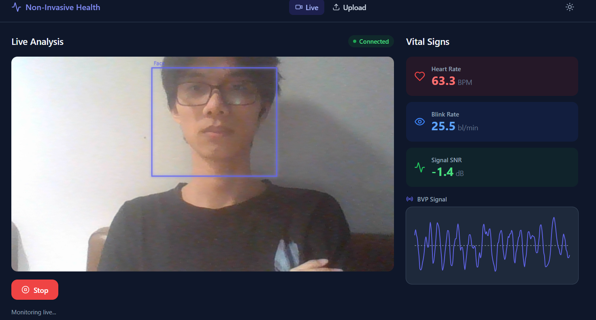
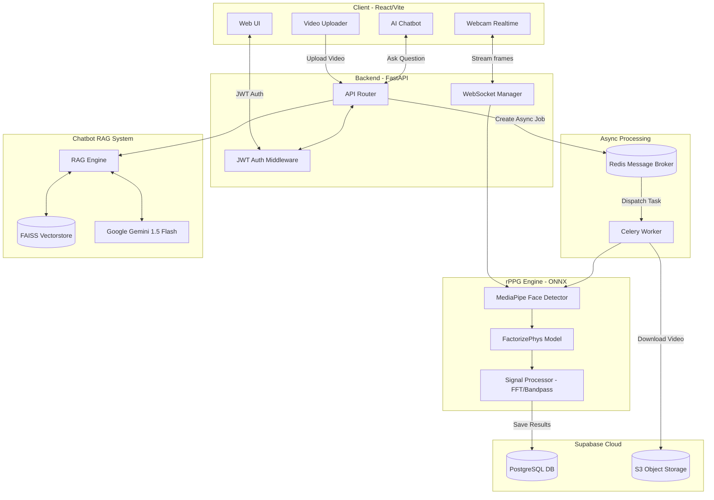

# Non-Invasive Health Analysis System

Hệ thống đo sinh trắc học không xâm lấn từ video khuôn mặt — trích xuất nhịp tim, tốc độ chớp mắt, tín hiệu BVP và tích hợp chatbot AI tư vấn sức khỏe.



## 🌟 Tính năng chính

- **Đo trực tiếp qua Webcam**: Phân tích nhịp tim, tốc độ chớp mắt và chất lượng tín hiệu (SNR) theo thời gian thực.
- **Phân tích Video Offline**: Hỗ trợ tải file video lên để xử lý phân tích chuyên sâu chạy nền.
- **AI Chatbot Y Tế**: Tích hợp Advanced RAG và Google Gemini để giải đáp ý nghĩa các chỉ số đo được và tư vấn sức khỏe dựa trên tài liệu chuẩn.
- **Quản lý lịch sử đo lường**: Lưu trữ và thống kê toàn bộ kết quả phân tích theo thời gian.

## 🏗 Kiến trúc hệ thống



Hệ thống được thiết kế với 4 phân lớp chính:
- **Computer Vision & rPPG**: Sử dụng MediaPipe cho Face Mesh, kết hợp ONNX Runtime chạy mô hình học sâu rPPG tiên tiến (FactorizePhys).
- **Signal Processing**: Trích xuất đặc trưng sinh trắc học qua Fast Fourier Transform (FFT) và Butterworth Bandpass Filter.
- **AI / NLP**: Sử dụng mô hình tạo sinh Gemini 1.5 Flash, hệ thống tìm kiếm Hybrid Search (FAISS + BM25) cho RAG.
- **Web Fullstack**: Backend FastAPI (hỗ trợ WebSocket & Async processing) và Frontend React/Vite mượt mà, thân thiện.
- **Database & Job Queue**: Lưu trữ và xác thực tập trung bằng **Supabase (PostgreSQL & Auth)**. Phân bổ tài nguyên xử lý video siêu nặng bằng hệ thống hàng đợi phân tán **Celery + Redis**. Sử dụng **S3-compatible Object Storage (Supabase)** để quản lý file video an toàn.

## 🚀 Hướng dẫn cài đặt và chạy

### Yêu cầu môi trường
- Python 3.10+
- Node.js 18+
- Webcam (720p trở lên) để dùng chức năng đo trực tiếp.
- Tuỳ chọn CUDA (11.8+) nếu muốn tăng tốc độ rPPG.

### Khởi động hệ thống

1. **Cấu hình biến môi trường**
   - Copy file `.env.example` thành `.env` bên trong thư mục `backend/`.
   - Cập nhật chuỗi kết nối PostgreSQL (Supabase) vào `SUPABASE_DB_URL` và điền `GEMINI_API_KEY`.

2. **Cài đặt thư viện và Khởi tạo dữ liệu vector cho Chatbot (chạy lần đầu)**
   ```bash
   cd backend
   pip install -r requirements.txt
   python scripts/build_embeddings.py
   ```

3. **Khởi động Backend và Worker bằng Docker Compose**
   Hệ thống sử dụng Redis và Celery để xử lý ngầm, cách nhanh nhất là chạy qua Docker:
   ```bash
   docker-compose build
   docker-compose up -d
   ```
   *(Backend API sẽ chạy ở port 8001)*

3. **Chạy Giao diện Frontend (trên terminal mới)**
   ```bash
   cd frontend
   npm install
   npm run dev
   ```

Sau khi hoàn tất, mở trình duyệt web tại địa chỉ: `http://localhost:3002`

## 📖 Hướng dẫn sử dụng nhanh

- **Đăng nhập / Đăng ký**: Tạo tài khoản hoặc đăng nhập để hệ thống có thể lưu trữ và theo dõi lịch sử đo lường sức khỏe của riêng bạn.
- **Tab Live**: Cấp quyền sử dụng camera. Giữ tư thế ngồi yên, nhìn thẳng vào màn hình tại môi trường đủ sáng. Kết quả sức khỏe sẽ được cập nhật liên tục sau vài giây.
- **Tab Upload**: Tải lên video khuôn mặt (định dạng MP4/AVI) để hệ thống tự động xử lý.
- **Trợ lý Ảo AI**: Mở cửa sổ chat ở góc phải bên dưới màn hình để bắt đầu trò chuyện và nhận tư vấn sức khỏe từ AI. (Lưu ý: Không thay thế chẩn đoán của bác sĩ chuyên khoa).

> **Tài liệu chi tiết**: Để xem thêm các mô hình rPPG đã hỗ trợ và kiến trúc chuyên sâu, hãy xem tại branch documents

## 📊 Kết quả Benchmark

Đánh giá hệ thống đo nhịp tim rPPG trên 10 người dùng với 3 điều kiện thực tế (chỉ số đánh giá: MAE - Sai số tuyệt đối trung bình, càng nhỏ càng tốt):

### 1. Bình thường (Ngồi yên)
- **Model tối ưu:** `FactorizePhys` — MAE: **~0.04 bpm**


### 2. Chuyển động đầu
- **Model tối ưu:** `FactorizePhys` — MAE: **~0.83 bpm**


### 3. Đang nói chuyện
- **Model tối ưu:** `EfficientPhys` — MAE: **~1.67 bpm**


> *Kết luận: Hệ thống đạt độ chính xác cao (sai số < 2 bpm) ngay cả trong môi trường có nhiễu.*
