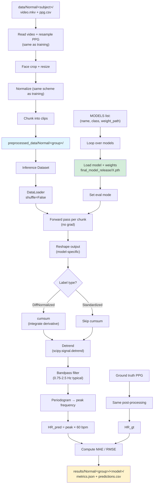

# Inference pipeline

Mỗi inference notebook trong [notebooks_inference/](../notebooks_inference/) tuân
theo cùng 1 pipeline. Cell ordering:

```
1. Imports
2. ## Inlined source                  (model code đã inline)
3. Paths + hyperparameters + MODELS list (tên model + weight path)
4. Preprocessing helpers              (giống y hệt training để bảo đảm consistency)
5. Discover subjects + read ground truth
6. Data preprocessing (cache .npy)
7. Dataset class + DataLoader
8. Post-processing functions          (detrend, bandpass, FFT)
9. Main inference loop (per model, per subject → metrics)
10. Convert metrics.json → CSV
```

## Sơ đồ luồng dữ liệu



## MODELS list pattern

Mỗi inference notebook có 1 cell `MODELS` liệt kê các weights cần test:

```python
MODELS = [
    ("PURE_DeepPhys",              "DeepPhys", "final_model_release/PURE_DeepPhys.pth"),
    ("UBFC-rPPG_DeepPhys",         "DeepPhys", "final_model_release/UBFC-rPPG_DeepPhys.pth"),
    ("MA-UBFC_deepphys",           "DeepPhys", "final_model_release/MA-UBFC_deepphys.pth"),
    # ... mỗi entry là 1 weight để benchmark
]
```

Inference loop sẽ lặp qua tất cả → 1 output folder cho mỗi `(model_name, weight)`.

## Post-processing chi tiết

Khác nhau giữa các nhóm — xem [notebook_groups.md](notebook_groups.md) hoặc
[../notebooks_inference/model_groups.md](../notebooks_inference/model_groups.md):

| Bước | Nhóm A/B/C/D/E | Nhóm F/G |
|---|---|---|
| Cumsum trên prediction | ✓ (label = DiffNormalized) | ✗ (label = Standardized) |
| Detrend | ✓ | ✓ |
| Bandpass filter | ✓ | ✓ |
| FFT peak → HR | ✓ | ✓ |

## Output sau inference

```
results/Normal/<group>/<model>/
├── metrics.json          {MAE, RMSE, Pearson_r, n_subjects, ...}
├── predictions.csv       {subject_id, chunk_id, pred_hr, gt_hr, error}
└── (optional) plots/
```
