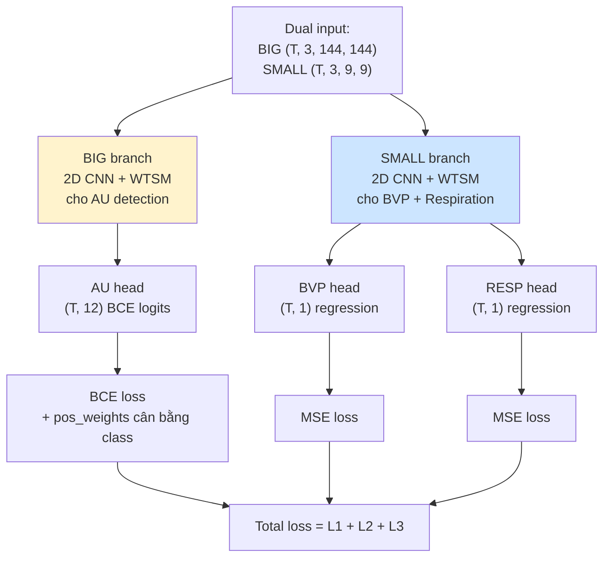
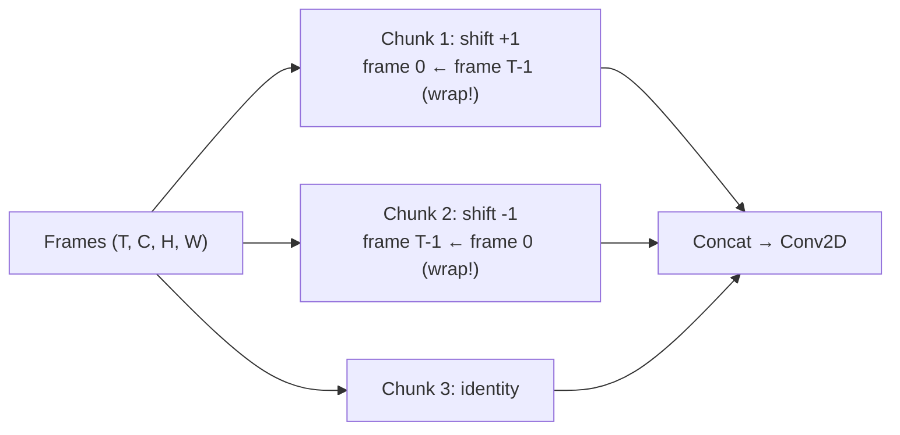

# BigSmall

> **BigSmall: Efficient Multi-Task Learning For Physiological Measurements**
> Narayanswamy et al., 2023

Multi-task multi-resolution network: 1 model predict đồng thời **BVP (rPPG)
+ Respiration + Facial Action Units (12 AUs)**. Sử dụng 2 đầu vào ở 2
resolutions khác nhau cho 2 nhánh task khác nhau.

## Ý tưởng cốt lõi

> "Action Units (AU) cần resolution cao (mặt rõ ràng) → 144×144. BVP và
> respiration là 'subtle pulse' → có thể downsample xuống 9×9 mà vẫn giữ
> được signal. Train chung 3 tasks → multi-task regularization,
> features chia sẻ qua TSM."

## Kiến trúc



## Building blocks

### WTSM — Wrapping Time Shift Module

Tương tự TSM nhưng wrap-around thay vì zero-pad ở edge frames:



**Tại sao wrap?** Cardiac signal là **periodic** → wrap-around tạo continuity
hợp lý hơn zero-pad. Chunk length nhỏ (=3) → mỗi clip rất ngắn → wrap quan
trọng hơn TSM thông thường.

### Dual resolution

| Resolution | Channel | Task |
|---|---|---|
| **Big (144×144)** | 3 RGB (Standardized) | Facial Action Units — cần detail spatial |
| **Small (9×9)** | 3 RGB (DiffNormalized) | BVP + Respiration — average pulse signal |

**Insight**: Small 9×9 = 81 pixels là đủ để average colour change theo nhịp
tim. Cost giảm 256× so với 144×144 cho 2 task BVP/RESP.

## Multi-task loss

```python
loss = BCE(au_out, target_au) + MSE(bvp_out, target_bvp) + MSE(resp_out, target_resp)
```

**AU loss có `pos_weight`** để cân bằng class imbalance (AU như AU09, AU24 hiếm hơn AU06, AU12):
```python
AU_weights = [9.64, 11.74, 16.77, 1.05, 0.53, 0.56, 0.75, 0.69, 8.51, 6.94, 5.03, 25.00]
criterionAU = nn.BCEWithLogitsLoss(pos_weight=AU_weights)
```

## Label format (49 channels)

Label `(T, 49)` chứa cả 3 task:
- `[0]` = BVP wave
- `[5]` = respiration wave
- `[8:48]` mảng AU (12 AU labels được index theo `LABEL_IDXS_AU`)

Notebook chỉ dùng các index cần thiết, ignore phần còn lại.

## Input / Output

| | Shape | Ghi chú |
|---|---|---|
| Input | dict `{0: big (T,3,144,144), 1: small (T,3,9,9)}` | Stored as **.pickle** |
| Output | tuple `(au_logits, bvp, resp)` | shapes `(T,12)`, `(T,1)`, `(T,1)` |
| Chunk length | 3 | Rất ngắn — phù hợp với WTSM wrap-around |

## Sử dụng trong repo

- **Notebook**: [bigsmall_training.ipynb](../../notebooks_training/bigsmall_training.ipynb), [bigsmall_inference.ipynb](../../notebooks_inference/bigsmall_inference.ipynb)
- **Class**: `BigSmall(n_segment=3)`
- **Loss**: BCE (AU, pos_weight) + MSE (BVP) + MSE (RESP)
- **Weights pre-trained**: `BP4D_BigSmall_Multitask_Fold1.pth`, `Fold2.pth`, `Fold3.pth`

## Khi nào dùng BigSmall

✓ Cần đồng thời BVP + Respiration + Facial Action (e.g. emotion recognition)
✓ Có dataset có cả 3 label types (BP4D)
✗ Chỉ cần HR → các model 1-task khác (DeepPhys, PhysNet, ...) đơn giản hơn

## Best practice trong repo

Trong [bigsmall_training.ipynb](../../notebooks_training/bigsmall_training.ipynb), best-checkpoint được save
theo **val BVP loss** (chứ không phải tổng loss) vì BVP là signal chính
cho benchmark HR-MAE.
