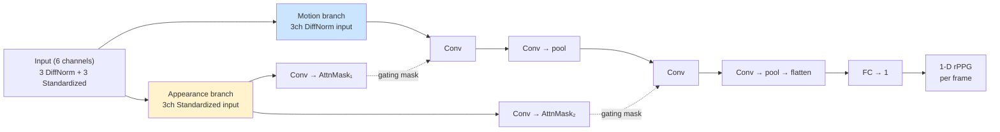

# DeepPhys

> **DeepPhys: Video-Based Physiological Measurement Using Convolutional Attention Networks**
> Chen & McDuff, ECCV 2018

Bài toán nền tảng đầu tiên dùng deep learning cho rPPG. Là baseline mà các
model sau (TS-CAN, EfficientPhys) extend lên.

## Ý tưởng cốt lõi

> "Skin có pulse → màu da biến đổi cực nhỏ theo nhịp tim. Frame difference
> + spatial attention sẽ làm nổi vùng có signal mạnh nhất."

## Kiến trúc

**2 branches song song**, mỗi branch là 2D CNN:

- **Motion branch**: input là frame differences (đã normalize bằng DiffNorm) → học pulse waveform.
- **Appearance branch**: input là raw frame chuẩn hóa → học **spatial attention mask**.
- Mask từ appearance branch **gating** motion features → motion branch chỉ tập trung vùng da có pulse.

## Kỹ thuật cụ thể

| Kỹ thuật | Mục đích |
|---|---|
| **DiffNormalized input** | Highlight subtle skin tone change frame-to-frame |
| **Attention masks** | Spatial gating → bỏ qua background, focus mặt |
| **Sigmoid mask + L1 norm** | Mask values normalize sao cho `sum = H×W/2` → tránh overfit |
| **Frame-independent** | Mỗi frame predict 1 giá trị PPG độc lập (không có temporal recurrence) |

## Input / Output

| | Shape | Ghi chú |
|---|---|---|
| Input | `(N*D, 6, 72, 72)` | 6ch = 3 DiffNorm + 3 Std, flatten (N, D) |
| Output | `(N*D, 1)` | rPPG value cho mỗi frame |

## Sử dụng trong repo

- **Notebook**: [groupA_training.ipynb](../../notebooks_training/groupA_training.ipynb), [groupA_inference.ipynb](../../notebooks_inference/groupA_inference.ipynb)
- **Class**: `DeepPhys(img_size=72)`
- **Loss**: `nn.MSELoss()` (frame-level)
- **Weights pre-trained**: `PURE_DeepPhys.pth`, `UBFC-rPPG_DeepPhys.pth`, `SCAMPS_DeepPhys.pth`, `BP4D_PseudoLabel_DeepPhys.pth`, `MA-UBFC_deepphys.pth`

## Hạn chế

- **Không có temporal modeling** → mỗi frame độc lập → bỏ qua thông tin nhịp.
- Vì lý do đó **TS-CAN** ra đời để thêm temporal context.

Xem thêm: [TS-CAN.md](TS-CAN.md), [EfficientPhys.md](EfficientPhys.md).
