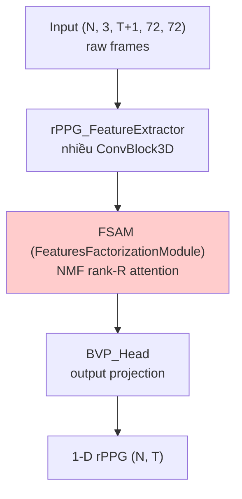

# FactorizePhys

> **FactorizePhys: Matrix Factorization for Multidimensional Attention in Remote Physiological Sensing**
> Joshi, Agaian, Cho — NeurIPS 2024

3D CNN backbone + **FSAM (Factorized Self-Attention Module)** dùng
Non-negative Matrix Factorization (NMF) thay self-attention quadratic.
Model **siêu nhẹ** (~220 K params) nhưng accuracy ngang với model lớn hơn 100×.

## Ý tưởng cốt lõi

> "Self-attention computes pairwise similarity O(N²). Nhưng pulse signal
> có **low-rank structure** (chỉ 1 dominant frequency). Có thể factorize
> attention map thành tích 2 ma trận hạng thấp: `A ≈ B · C` với rank `R=1`.
> NMF cho phép factorize không âm → bias toward sparse, interpretable features."

## Kiến trúc



## FSAM — NMF Attention

Đây là phần "magic" của model:

```mermaid
flowchart LR
    F["Features (N, C, T, H, W)<br/>flatten thành (B, D, HW·T)"]
    F --> B["Bases (B, D, R)<br/>learned initialization"]
    F --> C["Coefficients (B, R, HW·T)<br/>learned"]

    B --> MULT["Reconstruct:<br/>F̂ = B · C"]
    C --> MULT
    MULT --> ITER{Iterative<br/>multiplicative update<br/>k steps}
    ITER -.->|update B| B
    ITER -.->|update C| C
    ITER --> RES[Residual: x = x + λ · (F̂ - F)]
    RES --> OUT[Output features]
```

**NMF update rules** (multiplicative, đảm bảo bases/coef không âm):
```
C ← C * (Bᵀ F) / (Bᵀ B C + ε)
B ← B * (F Cᵀ) / (B C Cᵀ + ε)
```

Lặp `MD_STEPS=3` lần. Sau đó cộng residual `(F̂ - F)` vào feature gốc.

### md_config

```python
md_config = {
    "MD_FSAM": True,        # enable factorization
    "MD_TYPE": "NMF",       # vs "VQ" alternative
    "MD_TRANSFORM": "T_KAB", # cách reshape (T, K, A, B = batch, ...)
    "MD_R": 1,              # rank = 1 — chỉ cần 1 component cho pulse signal
    "MD_S": 1,
    "MD_STEPS": 3,          # NMF iteration count
    "MD_RESIDUAL": True,    # add (F̂ - F) residual
    "MD_INFERENCE": True,   # True at inference
}
```

**`MD_R=1`** là điểm thú vị — chỉ 1 rank cho cả attention map. Lý do:
pulse signal về cơ bản là 1 sinusoid đơn → 1 component đủ.

## Kỹ thuật cụ thể

| Kỹ thuật | Mục đích |
|---|---|
| **NMF rank-1 attention** | O(N·R) thay O(N²); R=1 đủ vì pulse low-rank |
| **Multiplicative update** | Iterative refinement của bases/coef |
| **Residual injection** | Combine NMF features với raw features |
| **`appx_error` loss** | Reconstruction quality monitoring trong training |
| **Tiny params** | ~220 K → mobile-friendly nhất trong họ rPPG |

## Đặc biệt khi load weights

Code load với `strict=False`:
```python
model.load_state_dict(state_dict, strict=False)
```

Vì FSAM bases khởi tạo random (không phải learnable param theo nghĩa truyền
thống) — checkpoint không lưu hết, missing keys là OK.

## Input / Output

| | Shape | Ghi chú |
|---|---|---|
| Input | `(N, 3, T+1=161, 72, 72)` | NCDHW, raw frames, +1 pad |
| Output | tuple `(rPPG, vox_embed, factorized_embed, appx_error)` | dùng `[0]` shape `(N, T)` |
| Label normalization | Standardized | |

## Sử dụng trong repo

- **Notebook**: [groupF_training.ipynb](../../notebooks_training/groupF_training.ipynb), [groupF_inference.ipynb](../../notebooks_inference/groupF_inference.ipynb)
- **Class**: `FactorizePhys(frames=160, md_config=md_config, in_channels=3)`
- **Loss**: `Neg_Pearson()` trên `rPPG output`; monitor `appx_error`
- **Weights pre-trained**: `PURE_FactorizePhys_FSAM_Res.pth`, `UBFC-rPPG_FactorizePhys_FSAM_Res.pth`, `SCAMPS_FactorizePhys_FSAM_Res.pth`, `iBVP_FactorizePhys_FSAM_Res.pth`, `GroupF_FactorizePhys.pth`

## Param efficiency

| Model | Params | HR-MAE class |
|---|---|---|
| PhysFormer | ~30 M | excellent |
| RhythmFormer | ~13 M | excellent |
| EfficientPhys | ~9 M | good |
| PhysNet | ~3 M | good |
| **FactorizePhys** | **~220 K** | **excellent** |

→ **Best accuracy/param ratio**. Lý tưởng cho edge deployment.
