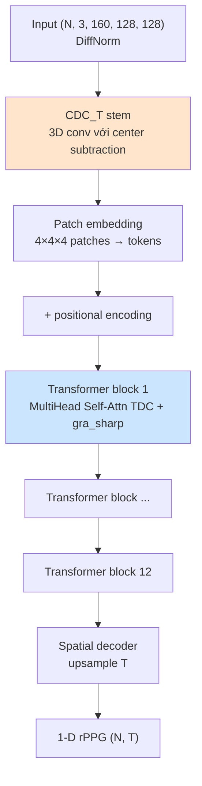
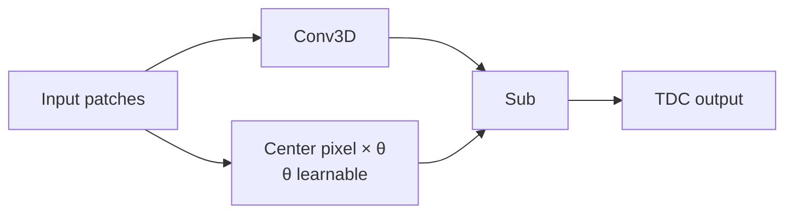

# PhysFormer

> **PhysFormer: Facial Video-based Physiological Measurement with Temporal Difference Transformer**
> Yu et al., CVPR 2022

Vision Transformer adapted cho rPPG, với 2 đóng góp chính: **Temporal
Difference Convolution (TDC)** stem và **gra_sharp** (gradient sharpening
trong self-attention).

## Ý tưởng cốt lõi

> "Transformer giỏi long-range modeling — ideal cho HR vì cardiac signal có
> periodicity dài. Nhưng raw RGB patches thiếu motion info → thay 3D conv
> stem bằng **TDC** (kernel - learnable θ × center) để encode subtle skin
> changes ngay từ stem."

## Kiến trúc



12 transformer layers, mỗi layer có:
- `MultiHeadedSelfAttention_TDC_gra_sharp`
- `PositionWiseFeedForward_ST` (spatio-temporal)

## Kỹ thuật cốt lõi

### 1. Temporal Difference Convolution (TDC)

```
TDC output = Conv(x) - θ × Conv(center_pixel_only)
```

Với `θ ∈ [0, 1]` learnable. Khi `θ = 1`, TDC giống y hệt **derivative
filter** — bắt motion/temporal change. Khi `θ = 0`, TDC = normal conv.



### 2. gra_sharp (Gradient Sharpening in Attention)

```python
attn_scores = Q @ K.T / sqrt(d_k)
attn_scores = attn_scores * gra_sharp    # ← sharpen
attn = softmax(attn_scores)
```

`gra_sharp = 2.0` → sắc nét attention map → tập trung vào ít token hơn,
phù hợp với pulse signal có pattern lặp.

**Lưu ý**: Khi forward, phải truyền `gra_sharp=2.0` explicit:
```python
rPPG, _, _, _ = model(data, 2.0)
```

### 3. Multi-task loss

3 loss components combine trong training:
- **NegPearson** (waveform shape match)
- **Frequency loss** (Cross-entropy on power spectrum) → ép peak FFT ở đúng HR
- **KL divergence** (distribution matching trong frequency domain)

Loss schedule:
```python
if epoch <= 10:
    a, b = 1.0, exp(epoch/10)    # warmup tăng dần weight frequency loss
else:
    a, b = 0.05, 5.0             # later epochs: ưu tiên frequency
loss = a * NegPearson + b * (freq_loss + kl_loss)
```

## Input / Output

| | Shape | Ghi chú |
|---|---|---|
| Input | `(N, 3, 160, 128, 128)` | NCDHW, DiffNorm. **Phải img_size=128** và T=160 (cho 4×4×4 patches) |
| Output | tuple, dùng `[0]` → `(N, T)` | |

## Sử dụng trong repo

- **Notebook**: [groupD_training.ipynb](../../notebooks_training/groupD_training.ipynb), [groupD_inference.ipynb](../../notebooks_inference/groupD_inference.ipynb)
- **Class**: `ViT_ST_ST_Compact3_TDC_gra_sharp(image_size=(160,128,128), patches=(4,4,4), dim=96, ff_dim=144, num_heads=4, num_layers=12, dropout_rate=0.2, theta=0.7)`
- **Loss**: `Neg_Pearson + TorchLossComputer.cross_entropy_power_spectrum_DLDL_softmax2`
- **Weights pre-trained**: `PURE_PhysFormer_DiffNormalized.pth`, `SCAMPS_PhysFormer_DiffNormalized.pth`, `UBFC-rPPG_PhysFormer_DiffNormalized.pth`

## Param count

~30 M — model lớn nhất trong họ rPPG hiện tại (12 layers × 96 dim × multi-head).
