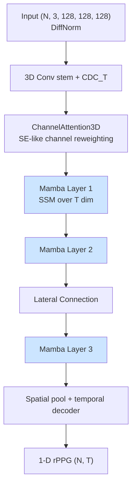
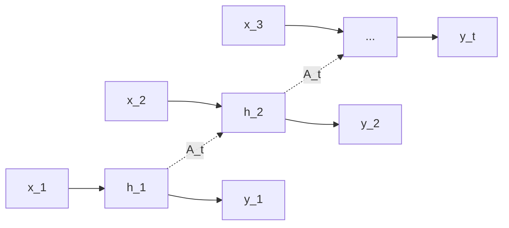

# PhysMamba

> **PhysMamba: State Space Duality Model for Remote Physiological Measurement**
> 2024

Thay self-attention quadratic O(N²) bằng **Mamba state-space model** O(N) → 3D
CNN backbone với Mamba layers trong temporal dim.

## Ý tưởng cốt lõi

> "Cardiac signal có temporal dependency dài (>5 giây = ~150 frames). Attention
> tính O(N²) cho chunk dài thì tốn. Mamba (S6 - Selective State Space) làm
> giống RNN nhưng song song hoá được training, cost O(N). Dùng Mamba
> trong temporal dim của 3D feature map."

## Kiến trúc



## Mamba Layer (S6)

State-space model với **selective** state update:

```
h_t = A_t · h_{t-1} + B_t · x_t       (state recurrence, learnable A, B per t)
y_t = C_t · h_t                       (readout)
```

- **A_t, B_t, C_t learnable per timestep** (selective = input-dependent)
- Parallel scan trong training → song song hoá được
- Recurrent trong inference → O(1) memory per token



## Kỹ thuật phối hợp

| Kỹ thuật | Mục đích |
|---|---|
| **CDC_T stem** | Bắt motion ngay từ input (theta=0.2 — lighter than PhysFormer) |
| **ChannelAttention3D** | SE block — reweight channels (giống Squeeze-Excitation) |
| **Mamba layers** | Thay attention, O(N) thay vì O(N²) |
| **LateralConnection** | Skip connection giữa Mamba layers |
| **DropPath** | Stochastic depth — regularization |
| **NegPearson loss** | Cùng PhysNet/PhysFormer |

## Trade-off vs Transformer

| | PhysFormer (Attention) | PhysMamba (Mamba) |
|---|---|---|
| Temporal cost | O(N²) | O(N) |
| Long-range modeling | ✓ tốt | ✓ tốt (RNN-like infinite context) |
| Parallelism (train) | ✓ | ✓ (parallel scan) |
| Parallelism (infer) | ✓ batch | Recurrent — slower |
| Param scale | ~30 M | ~3 M (gọn hơn 10×) |
| Hardware dep | Standard | Cần `mamba-ssm` kernel CUDA |

## Input / Output

| | Shape | Ghi chú |
|---|---|---|
| Input | `(N, 3, 128, 128, 128)` | NCDHW, DiffNorm |
| Output | tuple `(rPPG, _, _, _)` → `(N, 128)` | |

## Sử dụng trong repo

- **Notebook**: [groupE_training.ipynb](../../notebooks_training/groupE_training.ipynb), [groupE_inference.ipynb](../../notebooks_inference/groupE_inference.ipynb)
- **Class**: `PhysMamba(frames=128)`
- **Loss**: `Neg_Pearson()`
- **Weights pre-trained**: `PURE_PhysMamba_DiffNormalized.pth`, `UBFC-rPPG_PhysMamba_DiffNormalized.pth`
- **Dependency**: `mamba-ssm` package (CUDA-only)

## Lưu ý môi trường

Mamba dependency có thể fail với `bimamba` argument ở version mới — repo
gốc fix bằng cách pin version cụ thể. Nếu gặp `TypeError: Mamba.__init__()
got an unexpected keyword argument 'bimamba'`, cần downgrade `mamba-ssm`.
