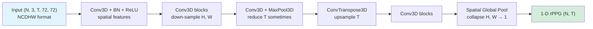

# PhysNet

> **Remote Photoplethysmograph Signal Measurement from Facial Videos Using Spatio-Temporal Networks**
> Yu et al., BMVC 2019

Model 3D CNN encoder-decoder đầu tiên cho rPPG. Là baseline trong họ 3D
(còn được gọi là **PhysNet_padding_Encoder_Decoder_MAX** trong code, vì
dùng MaxPool theo temporal).

## Ý tưởng cốt lõi

> "Thay vì xử lý từng frame riêng (2D + temporal hack), dùng **3D
> convolution** để xử lý cả khối `(T, H, W)` một lần. Spatial features và
> temporal features học cùng nhau."

## Kiến trúc



**Encoder-decoder** giống U-Net nhưng 3D:
- Encoder down-sample spatial (H, W → 1) qua nhiều conv3D
- Decoder upsample temporal về `T`
- Output collapse H, W cuối → 1-D signal

## Kỹ thuật cụ thể

| Kỹ thuật | Mục đích |
|---|---|
| **3D Convolution** | Xử lý spatio-temporal trong cùng layer |
| **MaxPool3D temporal** | Compress noisy frame info — "select" feature mạnh nhất |
| **Spatial Global Pool ở cuối** | Tổng hợp toàn bộ vùng da → 1-D signal |
| **DiffNormalized input** | Highlight subtle color change theo nhịp |
| **NegPearson loss** | Maximize correlation, không phải MSE → robust với scale/offset |

## NegPearson loss

```python
class Neg_Pearson(nn.Module):
    def forward(self, preds, labels):
        # 1 - Pearson correlation
        # ignore mean/std differences → focus shape matching
        return 1 - cosine_similarity(preds - preds.mean(), labels - labels.mean())
```

→ Pred và label có thể khác scale/offset (ví dụ DiffNorm khác Standardized),
nhưng nếu cùng **shape sóng** thì loss = 0.

## Input / Output

| | Shape | Ghi chú |
|---|---|---|
| Input | `(N, 3, T=128, 72, 72)` | NCDHW, DiffNorm |
| Output | tuple `(rPPG, x_visual, x_visual32, x_visual16)` — dùng `[0]` | shape `(N, T)` |

## Sử dụng trong repo

- **Notebook**: [groupC_training.ipynb](../../notebooks_training/groupC_training.ipynb), [groupC_inference.ipynb](../../notebooks_inference/groupC_inference.ipynb)
- **Class**: `PhysNet_padding_Encoder_Decoder_MAX(frames=128)`
- **Loss**: `Neg_Pearson()`
- **Weights pre-trained**: `PURE_PhysNet_DiffNormalized.pth`, `SCAMPS_PhysNet_DiffNormalized.pth`, `UBFC-rPPG_PhysNet_DiffNormalized.pth`, `BP4D_PseudoLabel_PhysNet_DiffNormalized.pth`, `MA-UBFC_physnet.pth`

## Vai trò trong rPPG landscape

PhysNet là **starting point của họ 3D-CNN**. Các model sau (iBVPNet,
FactorizePhys, PhysMamba) đều dùng cùng pattern "3D encoder + temporal
output" nhưng đổi khối feature extraction (NMF, Mamba SSM, ...).
