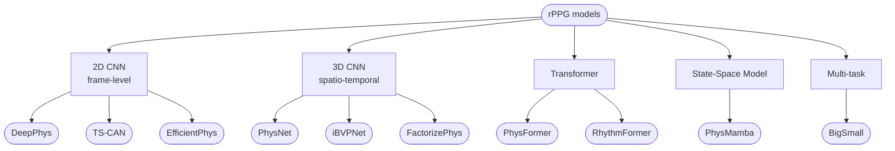

# Models — Techniques & Architecture

Mô tả ngắn gọn kỹ thuật của 10 models đang được dùng trong notebooks. Mỗi file
trong folder này tập trung vào **WHY** (tại sao chọn kiến trúc đó) thay vì
liệt kê config (config xem [../notebook_groups.md](../notebook_groups.md)).

## Phân loại theo họ kiến trúc



## Bảng so sánh nhanh

| Model | Họ | Năm | Đặc điểm chính | Param scale | Notebook |
|---|---|---|---|---|---|
| [DeepPhys](DeepPhys.md) | 2D CNN | 2018 | 2-branch: motion + appearance attention | ~9 M | groupA |
| [TS-CAN](TS-CAN.md) | 2D CNN + TSM | 2020 | DeepPhys + Temporal Shift Module | ~9 M | groupA |
| [EfficientPhys](EfficientPhys.md) | 2D CNN + TSM | 2023 | Single-branch, internal `torch.diff` | ~9 M | groupB |
| [PhysNet](PhysNet.md) | 3D CNN | 2019 | Encoder-decoder + MaxPool temporal | ~3 M | groupC |
| [PhysFormer](PhysFormer.md) | Transformer + TDC | 2022 | ViT + Temporal Difference Conv | ~30 M | groupD |
| [PhysMamba](PhysMamba.md) | SSM (Mamba) | 2024 | Bi-directional Mamba thay attention | ~3 M | groupE |
| [iBVPNet](iBVPNet.md) | 3D CNN | 2024 | Designed for iBVP dataset (multi-modal RGB-T) | ~6 M | groupF |
| [FactorizePhys](FactorizePhys.md) | 3D CNN + NMF | 2024 | Non-negative Matrix Factorization attention | ~220 K | groupF |
| [RhythmFormer](RhythmFormer.md) | Hierarchical TF | 2024 | Bi-level Routing Attention (BRA) + Fusion Stem | ~13 M | groupG |
| [BigSmall](BigSmall.md) | Multi-task 2D | 2023 | Dual resolution (144 + 9) → BVP + RESP + AU | ~2 M | bigsmall |

## Sơ đồ chung — Tất cả model giải bài toán gì?


Tất cả models đều output **1-D rPPG waveform** rồi qua post-processing
(detrend → bandpass → FFT) để lấy HR. Khác biệt chính giữa các models nằm ở:

1. **Cách encode thông tin temporal** (2D + temporal-shift vs 3D conv vs transformer attention vs Mamba SSM)
2. **Cách model "subtle skin colour change"** (attention masks, frame differencing, MaxPool temporal, etc.)
3. **Trade-off accuracy / latency / memory**

## Trade-off chính

```
                                ▲ Accuracy (HR-MAE thấp)
                                │
                  RhythmFormer ●│● FactorizePhys
                                │
                                │● PhysFormer
                                │
                       PhysMamba│● PhysNet
                                │
                     iBVPNet  ● │● TS-CAN
                                │
                  EfficientPhys●│● DeepPhys
                                │● BigSmall
                                │_____________________________▶
                                                Throughput (FPS)
                       (param ít, model nhẹ)        (param nhiều)
```

> Lưu ý: thứ tự định tính, dựa trên xu hướng chung trong literature. HR-MAE
> thực tế phụ thuộc dataset + preprocessing — xem CSV log trong
> `results/.../train_logs/` để so sánh trên dataset của bạn.

## Kỹ thuật cốt lõi xuất hiện lặp lại

| Kỹ thuật | Models dùng | Tóm tắt |
|---|---|---|
| **Attention mask** | DeepPhys, TS-CAN, EfficientPhys | Mask spatial → focus vùng da có pulse signal |
| **TSM** (Temporal Shift Module) | TS-CAN, EfficientPhys | Shift 1/3 channels theo time → cheap 1D temporal conv |
| **WTSM** (Wrapping TSM) | BigSmall | TSM nhưng wrap-around thay vì zero-pad |
| **TDC** (Temporal Difference Conv) | PhysFormer, PhysMamba, RhythmFormer | Conv kernel - learnable θ × center → giống motion feature |
| **Frame differencing** | EfficientPhys (internal), DiffNorm pre-processing | Highlight subtle skin tone change |
| **Per-clip normalization** | All 3D models | `(x - mean) / std` mỗi clip riêng → robust với illumination |
| **MaxPool temporal** | PhysNet | Reduce noisy temporal frames |
| **NMF attention** | FactorizePhys (FSAM) | Non-negative matrix factorization thay self-attention |
| **Bi-level Routing Attention** | RhythmFormer (BRA) | Sparse top-k attention theo region |
| **Mamba SSM** | PhysMamba | State-space O(N) thay vì O(N²) attention |
