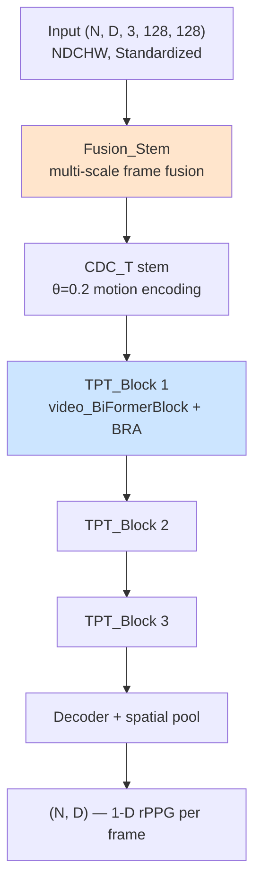
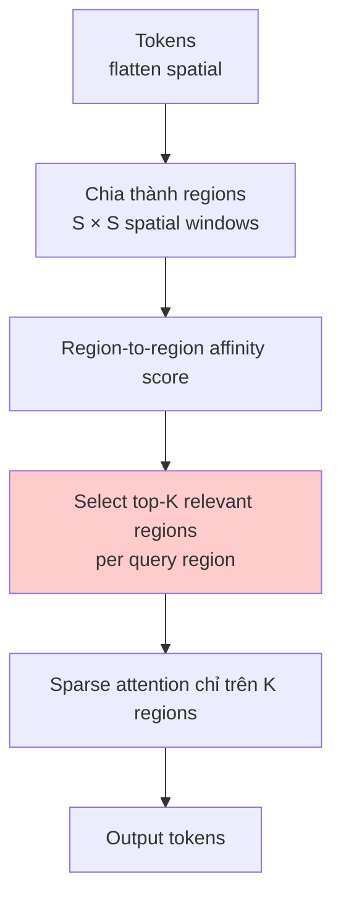

# RhythmFormer

> **RhythmFormer: Extracting rPPG Signals Based on Hierarchical Temporal Periodic Transformer**
> 2024

Hierarchical Transformer cho rPPG, sử dụng **Bi-level Routing Attention
(BRA)** + **Fusion Stem** để vừa nhẹ vừa modelling được long-range temporal
periodicity.

## Ý tưởng cốt lõi

> "Pulse signal có **periodicity** rõ rệt (60-100 bpm = 1-1.7 Hz). Thay vì
> full self-attention quadratic, chia frame thành regions, attention
> trong region trước (local), rồi route sparse top-k regions across the
> whole clip (global) → bắt được periodic structure mà cost vẫn O(N√N)."

## Kiến trúc



## Building blocks

### 1. Fusion_Stem

Multi-scale frame difference fusion ở input:
- Combine `frame[t]`, `frame[t]-frame[t-1]`, `frame[t]-frame[t-3]` etc.
- Concat → 3D conv stem

→ Bắt motion ở nhiều temporal scales ngay từ đầu.

### 2. CDC_T (theta=0.2)

```
TDC = Conv(x) - 0.2 × Conv(center)
```

Cùng kỹ thuật như PhysFormer/PhysMamba nhưng theta khác. Thấp (0.2) → ít
"derivative" hơn → giữ nhiều appearance hơn.

### 3. BRA — Bi-level Routing Attention



**2 tầng routing**:
1. **Coarse**: tính affinity giữa các regions (S²×S²)
2. **Fine**: cho mỗi query, chọn top-K target regions → attention chỉ giữa tokens trong K regions

→ Cost: O(N · K) thay O(N²). Với K=4 và N=1024 tokens → giảm 256× cost.

### 4. TPT_Block (Temporal Periodic Transformer)

`video_BiFormerBlock` = BRA + FFN + LayerNorm, áp dụng cả spatial và
temporal. Hierarchical: stack 3 blocks với resolution giảm dần.

## Kỹ thuật cụ thể

| Kỹ thuật | Mục đích |
|---|---|
| **Fusion Stem** | Multi-scale motion từ input |
| **CDC_T (θ=0.2)** | Motion-aware conv stem |
| **BRA (Bi-level Routing)** | Sparse top-K attention — O(N·K) thay O(N²) |
| **Hierarchical structure** | 3 levels of TPT blocks |
| **DropPath** | Stochastic depth regularization |
| **trunc_normal_** init | Variance-preserving initialization |

## Custom Loss: RhythmFormer_Loss

Tổ hợp 3 thành phần với schedule theo epoch:
- **NegPearson** (waveform shape)
- **Frequency loss** (FFT peak alignment)
- **Cross-entropy on HR distribution**

Loss expect 1-D inputs → phải loop per-sample trong batch (không vectorize được).

```python
loss = sum(criterion(pred[i], label[i], epoch, fps, diff_flag) for i in range(N)) / N
```

## Output normalization

Output phải normalize per-sample sau forward:
```python
pred = model(data)
pred = (pred - pred.mean(dim=-1, keepdim=True)) / (pred.std(dim=-1, keepdim=True) + 1e-7)
```

## Input / Output

| | Shape | Ghi chú |
|---|---|---|
| Input | `(N, D=160, 3, 128, 128)` | **NDCHW** (khác PhysFormer NCDHW) |
| Output | `(N, D=160)` | 1-D rPPG, **phải normalize per-sample** |
| Label normalization | Standardized | |

## Sử dụng trong repo

- **Notebook**: [groupG_training.ipynb](../../notebooks_training/groupG_training.ipynb), [groupG_inference.ipynb](../../notebooks_inference/groupG_inference.ipynb)
- **Class**: `RhythmFormer()`
- **Loss**: `RhythmFormer_Loss()` (custom — import from inlined source)
- **Weights pre-trained**: `PURE_RhythmFormer.pth`, `UBFC-rPPG_RhythmFormer.pth`

## Trade-off

| | RhythmFormer | PhysFormer |
|---|---|---|
| Attention | Sparse BRA | Full TDC + gra_sharp |
| Param | ~13 M | ~30 M |
| Hierarchical | ✓ 3 levels | ✗ flat 12 layers |
| Fusion stem | ✓ multi-scale | ✗ single stem |
| Accuracy | comparable, sometimes better | benchmark winner trên 1 số dataset |

RhythmFormer thường win khi clip dài (>160 frames) vì BRA scale tốt hơn.
