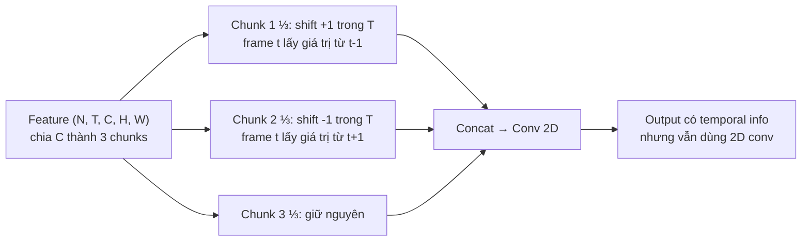
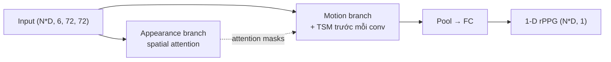

# TS-CAN

> **Multi-Task Temporal Shift Attention Networks for On-Device Contactless Vitals Measurement**
> Liu et al., NeurIPS 2020

DeepPhys + **Temporal Shift Module (TSM)** → thêm temporal context với
chi phí gần như 0.

## Ý tưởng cốt lõi

> "Convolution 2D không thấy thời gian. Nhưng nếu trước mỗi conv layer ta
> SHIFT một phần channels theo chiều time (1/3 channels lùi 1 frame, 1/3 tiến
> 1 frame, 1/3 giữ nguyên), thì conv 2D sẽ ngầm thấy thông tin của ±1 frame
> mà không cần thêm parameters."

## Temporal Shift Module (TSM)

**Trick**: zero-padding ở edge frames. TSM cần `base_len = frame_depth = 10`
→ batch size phải chia hết cho 10 để alignment đúng.

## Kiến trúc

So với DeepPhys: thêm **TSM trước mỗi 2D conv ở motion branch** → frame
t-1, t, t+1 cùng được thấy trong feature map.

## Kỹ thuật cụ thể

| Kỹ thuật | Mục đích |
|---|---|
| **TSM** | Temporal context với cost zero (chỉ shift, không thêm param) |
| **2-branch DeepPhys backbone** | Spatial attention + motion features |
| **base_len alignment** | Batch size phải là bội số của frame_depth=10 |
| **Frame-level output** | Vẫn predict per-frame, nhưng feature có temporal context |

## Variant: MTTS-CAN

`MTTS_CAN` cũng có trong inlined source — multi-task version học cả BVP +
respiration. Repo này không train MTTS-CAN nhưng class có sẵn.

## Input / Output

| | Shape | Ghi chú |
|---|---|---|
| Input | `(N*D, 6, 72, 72)` | Cùng DeepPhys |
| Output | `(N*D, 1)` | rPPG per frame |
| Constraint | `(N*D) % frame_depth == 0` | TSM cần alignment |

## Sử dụng trong repo

- **Notebook**: [groupA_training.ipynb](../../notebooks_training/groupA_training.ipynb), [groupA_inference.ipynb](../../notebooks_inference/groupA_inference.ipynb)
- **Class**: `TSCAN(frame_depth=10, img_size=72)`
- **Loss**: `nn.MSELoss()`
- **Weights pre-trained**: `PURE_TSCAN.pth`, `SCAMPS_TSCAN.pth`, `UBFC-rPPG_TSCAN.pth`, `BP4D_PseudoLabel_TSCAN.pth`, `MA-UBFC_tscan.pth`

## So sánh với DeepPhys

| | DeepPhys | TS-CAN |
|---|---|---|
| Temporal context | ✗ | ✓ (TSM) |
| Extra params | — | 0 (just shift) |
| Constraint trên N*D | ✗ | Phải chia hết cho frame_depth |
| Accuracy điển hình | Baseline | +5-15% HR-MAE |
