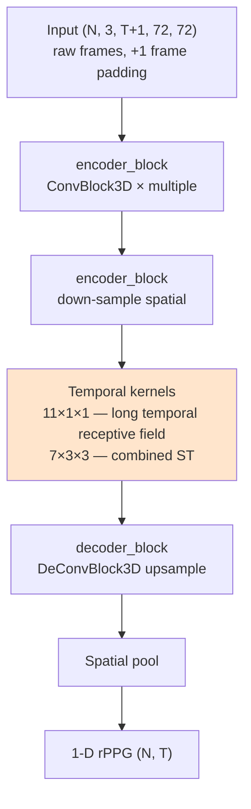

# iBVPNet

> **iBVP Dataset: RGB-Thermal rPPG Dataset with High Resolution Signal Quality Labels**
> Joshi & Cho, Electronics 2024

3D CNN encoder-decoder được thiết kế kèm theo dataset **iBVP**
(multi-modal RGB + thermal). Trong repo này chỉ dùng RGB branch.

## Ý tưởng cốt lõi

> "PhysNet dùng MaxPool temporal — mất chi tiết. iBVPNet dùng kernel kích thước
> lớn theo temporal (`[7, 3, 3]`, `[11, 1, 1]`) để bắt được chu kỳ tim mà không
> cần pool."

## Kiến trúc



## Building blocks

### ConvBlock3D

```python
class ConvBlock3D(nn.Module):
    Conv3d → Tanh → InstanceNorm3d
```

**Khác biệt với PhysNet**: dùng `Tanh` thay vì ReLU + `InstanceNorm3d` thay
vì BatchNorm → robust hơn với illumination variance (mỗi sample normalize
độc lập, không phụ thuộc batch).

### Long temporal kernels

Khác PhysNet (kernel `[3,3,3]`), iBVPNet dùng:
- `[11, 1, 1]` — temporal-only kernel (11 frames receptive field)
- `[11, 3, 3]` — combined ST
- `[7, 1, 1]`, `[7, 3, 3]` — medium temporal

→ Bắt được **1-2 chu kỳ tim** ngay trong 1 conv layer (60bpm = 30 frames/cycle
@ 30fps; receptive field 11 ~ 1/3 cycle).

## Kỹ thuật cụ thể

| Kỹ thuật | Mục đích |
|---|---|
| **Tanh activation** | Saturation → robust với outlier values |
| **InstanceNorm3d** | Per-sample normalization → robust với lighting |
| **Long temporal kernels** | Bắt cardiac periodicity ngay layer-level |
| **Frame padding +1** | Bù đắp internal temporal ops (giống EfficientPhys) |
| **Raw input** (không DiffNorm) | Model tự học motion từ raw |

## Input / Output

| | Shape | Ghi chú |
|---|---|---|
| Input | `(N, 3, T+1=161, 72, 72)` | NCDHW, **raw frames**, +1 pad temporal |
| Output | `(N, T=160)` | rPPG signal |
| Label normalization | Standardized | Khác PhysNet (DiffNorm) |

## Sử dụng trong repo

- **Notebook**: [groupF_training.ipynb](../../notebooks_training/groupF_training.ipynb), [groupF_inference.ipynb](../../notebooks_inference/groupF_inference.ipynb)
- **Class**: `iBVPNet(frames=160, in_channels=3)`
- **Loss**: `Neg_Pearson()`
- **Weights pre-trained**: `PURE_iBVPNet.pth`

## Vai trò trong họ rPPG

iBVPNet được benchmark cùng FactorizePhys (cùng tác giả Cho et al.) trong
[notebooks_training/groupF_training.ipynb](../../notebooks_training/groupF_training.ipynb) — 2 model dùng cùng pipeline
(raw input, +1 frame padding, Standardized label) nhưng khác cách extract
feature: iBVPNet dùng pure 3D conv, FactorizePhys dùng NMF-based attention.
