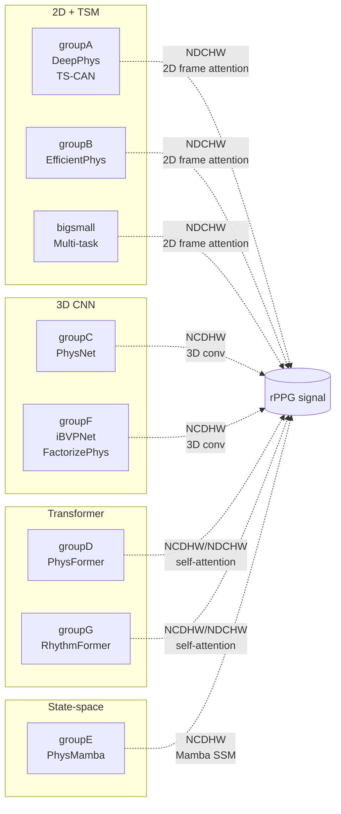

# 8 notebook groups — Cheat sheet

Các notebook được tổ chức theo **nhóm preprocessing**: tất cả model trong cùng
1 nhóm dùng cùng cách normalize input + shape → 1 preprocess run, lặp qua model.

| Notebook | Models | Input shape | Chunk | Channels | Img | Label norm |
|---|---|---|---|---|---|---|
| `bigsmall` | BigSmall | dual (Big 144, Small 9) | 3 | 3+3 | 144 / 9 | DiffNorm 49ch |
| `groupA` | DeepPhys, TS-CAN | NDCHW | 180 | 6 (DiffN+Std) | 72 | DiffNorm |
| `groupB` | EfficientPhys | NDCHW | 180 | 3 (Std) | 72 | DiffNorm |
| `groupC` | PhysNet | NCDHW | 128 | 3 (DiffN) | 72 | DiffNorm |
| `groupD` | PhysFormer | NCDHW | 160 | 3 (DiffN) | 128 | DiffNorm |
| `groupE` | PhysMamba | NCDHW | 128 | 3 (DiffN) | 128 | DiffNorm |
| `groupF` | iBVPNet, FactorizePhys | NCDHW (+1 pad) | 160 | 3 (Raw) | 72 | Standardized |
| `groupG` | RhythmFormer | NDCHW | 160 | 3 (Std) | 128 | Standardized |

Ghi chú format tensor:
- **NDCHW** = `(batch, depth, channels, H, W)` — frame-first layout
- **NCDHW** = `(batch, channels, depth, H, W)` — channel-first 3D-conv layout
- **+1 pad** = nhóm F append thêm 1 frame ở temporal dim (vì model dùng `torch.diff` internally)

## Sơ đồ phân nhóm



## Model output shape

| Group | Output | Lưu ý |
|---|---|---|
| bigsmall | `(au_logits, bvp, resp)` | Multi-task; BVP là rPPG |
| A (DeepPhys) | `(N*D, 1)` | Frame-independent |
| A (TS-CAN) | `(N*D, 1)` | Cần `base_len = frame_depth` |
| B | `(N*D, 1)` | Model làm `torch.diff` nội bộ → cần pad +1 frame ở input |
| C | tuple, dùng `[0]` shape `(N, T)` | |
| D | tuple, dùng `[0]` shape `(N, T)` | Cần truyền `gra_sharp=2.0` ở forward |
| E | `rPPG, _, _, _` shape `(N, T)` | |
| F (iBVPNet) | `(N, T)` | Cần pad +1 frame ở temporal dim |
| F (FactorizePhys) | tuple, dùng `[0]` | Load với `strict=False` |
| G | `(N, D)` | Cần normalize output per-sample sau forward |

Chi tiết hơn (md_config cho FactorizePhys, PhysFormer params, ...) xem
[../notebooks_inference/model_groups.md](../notebooks_inference/model_groups.md).

## Sự tương ứng training ↔ inference

```
notebooks_training/groupA_training.ipynb
  → trained weights →  final_model_release/GroupA_<model>.pth
                              ↓
notebooks_inference/groupA_inference.ipynb
  → loads → forward → HR
```

Mỗi training notebook **save 1 hoặc nhiều weights** vào `final_model_release/`.
Mỗi inference notebook đọc 1 list `MODELS = [(name, class, weight_path), ...]`
và lặp benchmark từng weight. Pre-trained weights (PURE, UBFC-rPPG, SCAMPS, BP4D,
MA-UBFC, iBVP) đã có sẵn trong `final_model_release/` để test ngay mà không cần
train lại.
