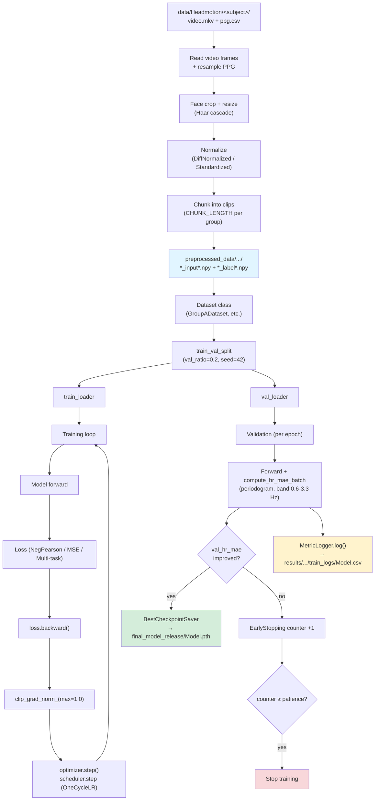

# Training pipeline

Mỗi training notebook trong [notebooks_training/](../notebooks_training/) tuân
theo cùng 1 pipeline. Cell ordering trong notebook:

```
1. Imports                           (os, torch, tqdm, ...)
2. ## Inlined source                  (model + loss code đã inline)
3. ## Training utilities              (set_seed, val_split, HR-MAE, savers...)
4. Paths + hyperparameters
5. Preprocessing helpers              (read_video, normalize, face crop)
6. Dataset discovery + preprocess     (chạy 1 lần, cache .npy)
7. Dataset class + train/val split + DataLoaders
8. Training loop (train + val per epoch, save best, early stop, CSV log)
```

## Sơ đồ luồng dữ liệu



## Training utilities chung (cell 3)

Tất cả 8 notebooks chia sẻ utility cell định nghĩa:

| Tên | Mục đích |
|---|---|
| `set_seed(42)` | Reproducibility (random + numpy + torch + CUDA + cudnn.deterministic) |
| `train_val_split(ds, 0.2, 42)` | Random split có seed cố định |
| `compute_hr_fft(sig, fps)` | HR (bpm) từ peak của periodogram trong band 0.6-3.3 Hz |
| `compute_hr_mae_batch(pred, label)` | Mean abs HR error trên batch |
| `BestCheckpointSaver(path, mode='min')` | Chỉ save khi metric improve |
| `EarlyStopping(patience=5)` | Dừng khi metric không improve |
| `MetricLogger(csv_path)` | Append CSV mỗi epoch |

## Common training-loop pseudocode

```python
saver   = BestCheckpointSaver(SAVE_PATH, mode="min")
stopper = EarlyStopping(patience=5, mode="min")
logger  = MetricLogger(LOG_PATH)

for epoch in range(EPOCHS):
    # ----- TRAIN -----
    model.train()
    for batch in train_loader:
        optimizer.zero_grad()
        pred = model(data)
        loss = criterion(pred, label)
        loss.backward()
        torch.nn.utils.clip_grad_norm_(model.parameters(), 1.0)
        optimizer.step()
        scheduler.step()

    # ----- VAL -----
    model.eval()
    with torch.no_grad():
        for batch in val_loader:
            pred = model(data)
            val_hr_mae += compute_hr_mae_batch(pred, label, fps=VIDEO_FPS)

    # ----- LOG + SAVE BEST + EARLY STOP -----
    saver.step(model, val_hr_mae)         # save if best so far
    logger.log(epoch=epoch, val_hr_mae=val_hr_mae, ...)
    if stopper.step(val_hr_mae):
        break
```

## Output sau training

- **Best weights**: `final_model_release/<Model>.pth`
- **Metrics log**: `results/<dataset>/<group>/train_logs/<Model>.csv` với schema
  `{epoch, train_loss, val_loss, val_hr_mae, lr, time_sec}`
